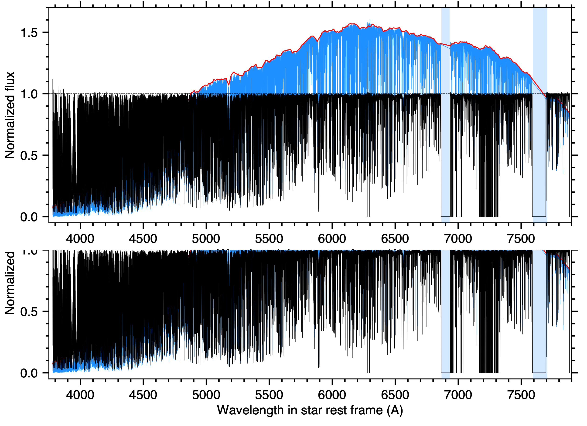
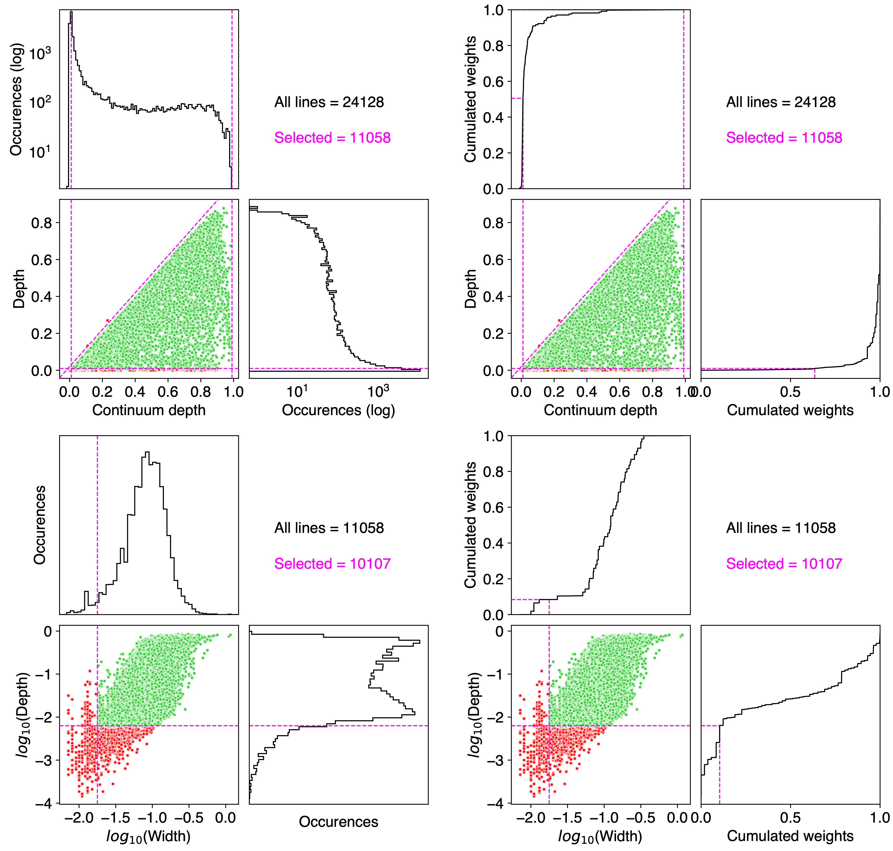

CCF mask
========

This tutorial explains how to generate a weighted mask directly from the datasets processed with ANTARESS. These masks can then be used to cross-correlate spectra and compute CCFs, either internally witgh ANTARESS, or with the standard ESPRESSO-like DRS. The interest of custom masks specific to a given star is that they can yield 
more stable and precise CCF time series (especially for G-K-M stars), compared to the DRS masks built over a sample of stellar types.
 
First, you need to have processed your data with ANTARESS into a single master spectrum of the unocculted star, following this tutorial (link).

TBD

  
  TBD.
  
  

TBD
  
  

  
  TBD.
  

TBD