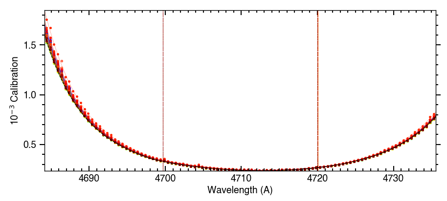
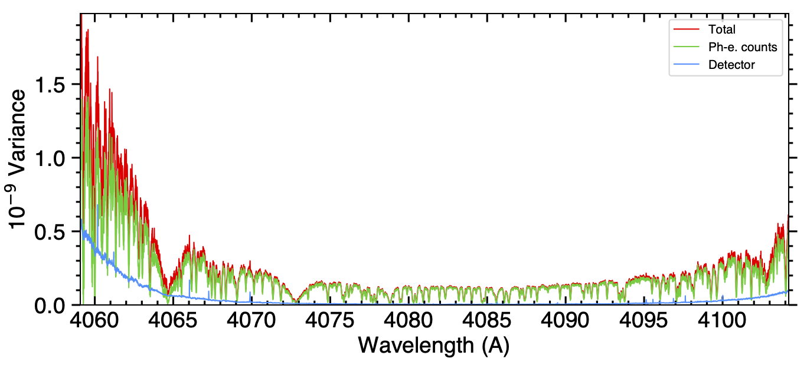
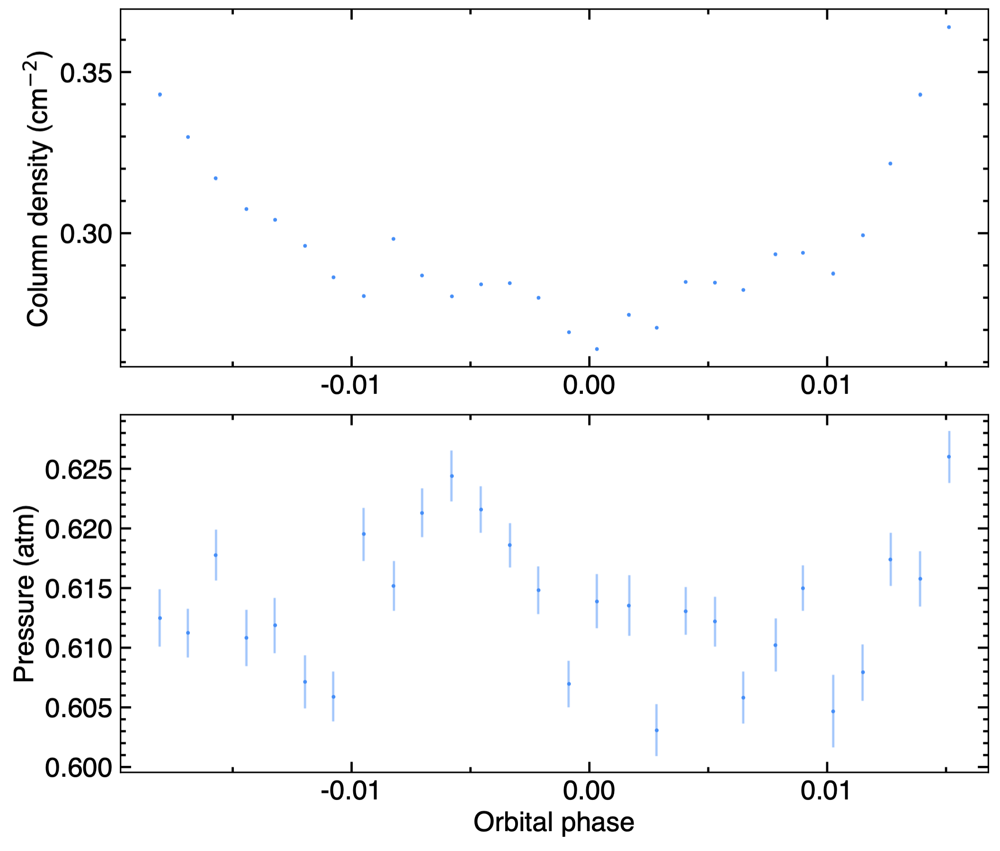
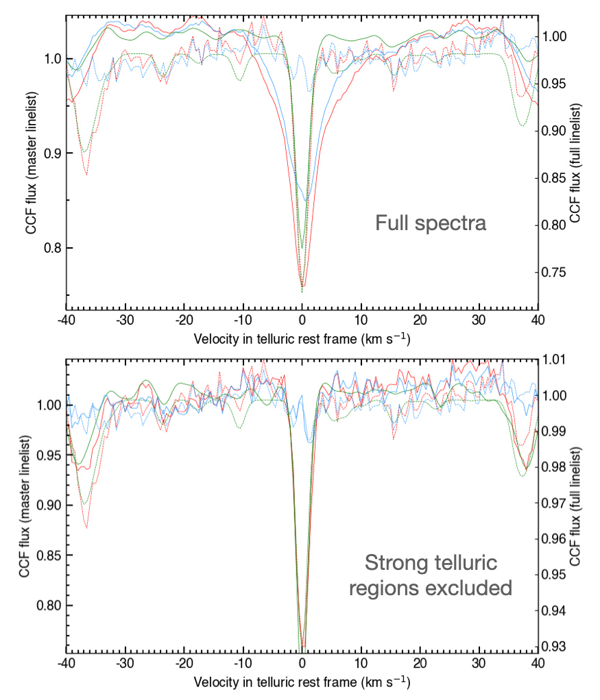
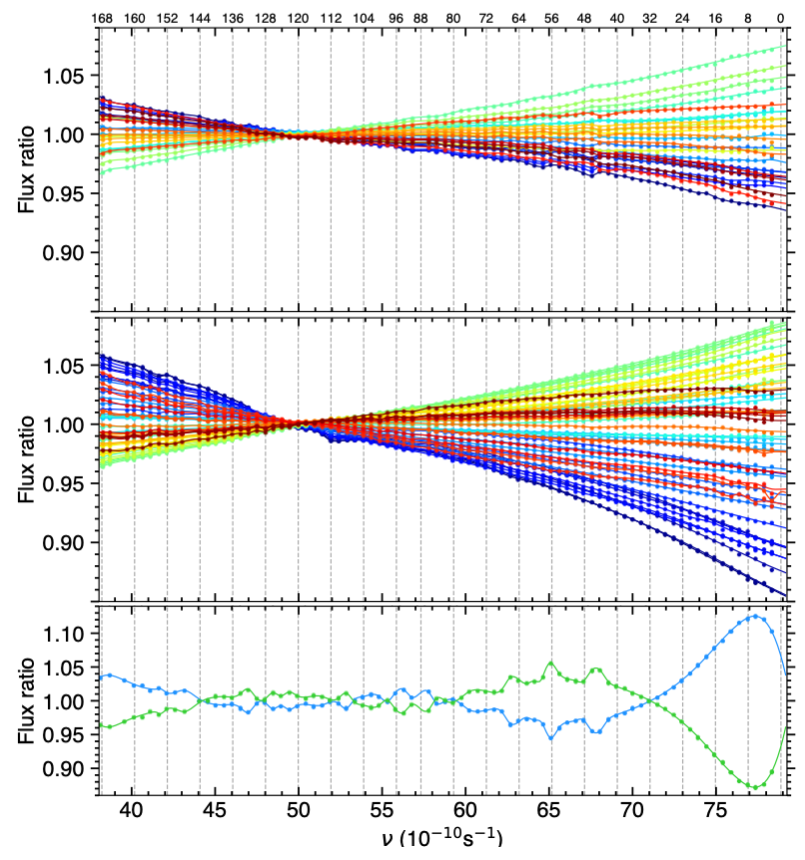
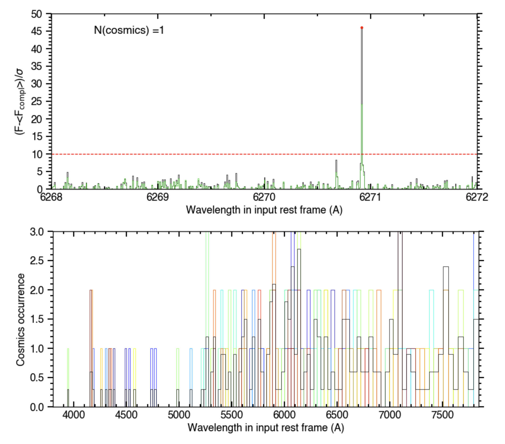

.. raw:: html

    

.. role:: orange

.. raw:: html

    

.. role:: green

.. raw:: html

    

.. role:: Magenta

2D spectral reduction
=====================

The present tutorial relates to the formatting and cleaning of time-series of 2D echelle spectra, as provided by the DRS of standard spectrographs.
Even if you are only interested in using ``ANTARESS`` to analyze a specific spectral range, we recommend processing the full spectra as some corrections benefit from exploiting the maximum information. Spectra can be :ref:`trimmed <Reduc_sec_trim>`) to your range of interest at the end of the spectral reduction.
Once reduced, the spectral time-series can be further processed by the workflow for a variety of purposes, in particular the extraction and analysis of spectra from the stellar and planetary atmospheres.
We illustrate the tutorial with ESPRESSO observations of TOI-421b (on 2022-11-17) and TOI-421c (on 2023-11-06).

We assume that you have already `set up your system and dataset <https://obswww.unige.ch/~bourriev/antaress/doc/html/Fixed_files/procedures_setup/procedures_setup.html>`_.

.. toctree::
   :hidden:

   procedures_tell/procedures_tell
   procedures_wig/procedures_wig
..
  Erik: every time a plot is mentioned can you add the path to the plot directory, if that's not yet the case ?

.. _Reduc_sec_cal:

Calibration
-----------

The first step is the ``Instrumental calibration`` module, which defines instrumental calibration profiles used to scale back spectra from flux to extracted count units, and to calculate spectral weight profiles.

The present module is always active in spectral mode. Set it to *calculation* mode (:green:`gen_dic['calc_gcal'] = True`).

If blazed data are available (:orange:`S2D_BLAZE.fits` files from ESPRESSO-like DRS) you can store them in the same directory as the input data.
Then by activating :green:`gen_dic['gcal_blaze']=True` the module will use the blazed data to retrieve the exact calibration profile as well as the detector noise.
If this option is set to `False` only calibration profiles are estimated, using input flux and error tables (if available).

The measured calibration profiles have low-frequency variations and are binned before being fitted with an analytical model.
The spectral bin size can be adjusted through the option :green:`gen_dic['gcal_binw']` (in :math:`\\A`), and should be large enough to smooth out high-frequency noise variations.  
For low-SNR data you can group :green:`gen_dic['gcal_binN']` exposures together to better estimate the calibration profiles.

Binned calibration profiles are then fitted with a piecewise function consisting of a low-order central polynomial joined with higher-order polynomials on each side to better capture sharp blaze variations at the edges of spectral orders.
You can control the range covered by the edge polynomials (in fraction of the order range) with::

 gen_dic['gcal_edges']={'blue':0.3,'red':0.3}
 
And the degree of the three polynomials with::

 gen_dic['gcal_deg']={'blue':4,'mid':2,'red':4}

Outliers to the binned calibration profiles can be automatically excluded from the fit by setting thresholds applied within orders (:green:`'outliers'`) and over all orders (:green:`'global'`), for a given instrument. 
This clipping is usually not required when calibration profiles can be extracted from blazed data.

You can plot the spectral calibration profiles from each order of the spectrograph (:numref:`cal_prof`) with :green:`plot_dic['gcal_ord']='pdf'`. 
If blaze profiles are not available numref:`cal_prof` is useful to check that your settings for the module allow estimating correctly the calibration profiles from the input data.

  
  Calibration profile for a spectral order during the 2023-11-06 visit. Dots and solid lines show the measured and fitted calibration profiles, respectively, for each exposure (colored over the rainbow scale).
  Vertical lines indicate the transitions between the model piecewise polynomials. 

You can compare the relative noise contributions from photons and from the detector in each order (:numref:`noises_ord`) with :green:`plot_dic['noises_ord']='pdf'`. 
This provides useful insights into the weights of these two noise sources in various spectral ranges and detector locations.   

  
  Variances, in flux units, associated to the spectral density of unblazed counts measured in a blue ESPRESSO order during one of the 2023-11-06 exposures.
  In regions with lower raw photoelectron counts (at short wavelengths, at the edges of orders, and at the bottom of deep stellar lines) the relative contribution of the detector noise (blue profile) to the total variance (red profile) increases compared to photon noise from the star (green profile).

Those plots are saved in :orange:`/Working_dir/Star/Planet_Plots/General/gcal/Instrument/Visit/`. 

Once you are satisfied with the results of the module, you can set it to *retrieval* mode (:green:`gen_dic['calc_gcal'] = False`). 

.. _Reduc_sec_tell:

Telluric correction
-------------------

The next step deals with the correction of telluric absorption lines. 
The DRS of some spectrographs provide telluric-corrected 2D echelle spectra, in which case you can skip this step - although you may still be interested in comparing both corrections.

The present version of ``ANTARESS`` calculates a telluric spectrum from a simple model of Earth atmoshere, computes its CCF over a selection of strong telluric lines, and fits it to the equivalent CCF from the spectrum measured in each exposure.
This approach exploits two types of static files: a list of telluric lines (mandatory) and a resolution map of the spectrograph (optional).  
These files already exist for several instruments, and we provide routines and tutorials to define `resolution maps <https://obswww.unige.ch/~bourriev/antaress/doc/html/Fixed_files/procedures_resmaps/procedures_resmaps.html>`_ for additional spectrographs and `telluric linelists <https://obswww.unige.ch/~bourriev/antaress/doc/html/Fixed_files/procedures_reduc/procedures_tell/procedures_tell.html>`_ optimized to a specific wavelength range.    

Activate the ``Telluric correction`` module (:green:`gen_dic['corr_tell'] = True`) and set it to *calculation* mode (:green:`gen_dic['calc_corr_tell'] = True`).
Then define which telluric species should be corrected for. Here, we include water and oxygen as::

 gen_dic['tell_species']=['H2O','O2']

An initial run can be made to inspect the telluric correction performed with the default settings. 
You can check for the convergence of the telluric model fitted to the data by plotting its properties (with :green:`plot_dic['tell_prop']='pdf'`), and you can evaluate the fit quality by plotting the telluric CCFs of the model spectrum, observed spectrum, and their difference (with :green:`plot_dic[‘tell_CCF']='pdf'`, see :numref:`Tell_CCF_comp`).
These plots are saved in :orange:`/Working_dir/Star/Planet_Plots/Spec_raw/Tell_corr/Instrument_Visit/`. 

  
  Telluric water properties derived for the 2023-11-06 visit. The top and bottom panel show the integrated vapour and average pressure along the LOS, respectively, as a function of orbital phase. 

  
  Top panel: telluric CCF for O2 computed using the entire spectral range. Observed spectrum is shown as red, and blue represent the residuals after correction. Best fit telluric spectrum is shown in green. Bottom panel: same as top panel but the best fit telluric CCF is computed while excluding regions with strong telluric features.

Based on this first run you can decide to adjust several settings.

..
    The spectral orders to be included in the fit can be selected with::
    
     gen_dic['tell_ord_fit'] = {instrument:{visit:[idx0,idx1,...]}}
      
    Since the current fit is performed over a specific selection of strong telluric lines there is little reason to use this option, but it will be useful when template matching with a full telluric spectrum is implemented.

First, the continuum of the measured CCF may not be as flat as the model one, for example due to broadband spectral variations.
You can model the continuum of the model CCF with a polynomial instead of a flat line (with :green:`deg` between 1 and 4):: 

 gen_dic['tell_CCFcont_deg'] = {instrument:{visit:{molecule : deg}} 

And specify the range over which the continuum is defined (with :green:`rv` in the Earth rest frame, in km/s):: 

 gen_dic['tell_cont_range'] = {instrument:{visit:{molecule : [rv0,rv1]}}
  
You can further control the fit range, for example to exclude spurious features from lines close to the CCF mask lines (with :green:`rv` in the Earth rest frame, in km/s):: 

 gen_dic['tell_fit_range'] = {instrument:{visit:{molecule : [rv0,rv1]}}

Finally, the fitted telluric properties can be finely controlled using::
    
 gen_dic['tell_mod_prop']={instrument:{visit:{molecule:{par: { 'vary' : bool , 'value': float , 'min': float, 'max': float } } } }}        
    
The model properties (:green:`par`) are described in the configuration file, and the way to control them is described in the `fit tutorial <https://obswww.unige.ch/~bourriev/antaress/doc/html/Fixed_files/procedures_fits/procedures_fits.html>`_.  

Once the fit is performed you can control how to correct the spectra using your best-fit telluric model.
Pixels where the model telluric lines are deeper than a contrast threshold (0 for no absorption, 1 for full absorption) are set to undefined. You can change the default value of 0.9 with::

 gen_dic['tell_thresh_corr'] = 0.9 
 
You can choose which exposures (index :green:`idx_exp` counted from 0), spectral orders (index :green:`idx_ord` counted from 0), and spectral ranges (independent wavelength intervals bounded by :green:`l` in :math:`\\A` in the Earth rest frame)) should be corrected for with::

 gen_dic['tell_exp_corr'] = {instrument:{visit: [idx_exp] }} 
 gen_dic['tell_ord_corr'] = {instrument:{visit: [idx_ord] }}
 gen_dic['tell_range_corr'] = {instrument:{visit: [[l0,l1],[l2,l3],..] }}

To inspect the quality of the telluric correction you can plot the flux spectra (:green:`plot_dic['sp_raw']='pdf'`) from each exposure, 
comparing the input (:green:`plot_settings[key_plot]['plot_pre']='raw'`) and telluric-corrected (:green:`plot_settings[key_plot]['plot_post']='tell'`) spectra, and 
overplotting the best-fit telluric model (:green:`plot_settings[key_plot]['plot_tell'] = True`).
 
.. Tip:: 
 Deep telluric lines can get overcorrected, especially toward longer wavelengths of the optical range where such lines can contaminate broad range of the spectra.
 This may become apparent through poorly-fitted telluric CCFs (look out for large variations in the blue residual profile of :numref:`Tell_CCF_comp`) and emission-like features around masked telluric lines in the corrected spectra (:numref:`glob_mast`).
 In that case, the best option might be to exclude those telluric-contaminated regions from the entire workflow process.
 First, identify the ranges to exclude by using the aforementioned plot routines, or a master spectrum of the visit computed through the ``Stellar masters`` module::

  gen_dic['glob_mast']=True
  gen_dic['calc_glob_mast']=True 
  plot_dic['glob_mast']='pdf'
  
 Then, go back to the configuration file and define the spectral regions to mask (in :math:`\\A` in the solar barycentric rest frame)::

  gen_dic['masked_pix'] = {'ESPRESSO':{'20231226':{
      'exp_list':[],'ord_list':{146:[[6865.,6930.]],147:[[6865.,6930.]],
                                162:[[7590.,7615.]],163:[[7590.,7615.]],
                                164:[[7590.,7690.]],165:[[7590.,7690.]]}}}}
      
 This field allows you to define the indexes of the exposures (:green:`exp_list`) and spectral orders (:green:`ord_list`) which should be masked. 
 In the present example we mask all exposures, in the six orders (actually, duplicated ESPRESSO slices that cover the same spectral range) that typically contain the deep telluric lines to mask in ESPRESSO datasets (:numref:`glob_mast`).
 You can also decide to remove orders entirely from the workflow process, using the field :green:`gen_dic['del_orders']`, but we advise masking specific spectral ranges to keep as much exploitable data as possible.

 ..
   Erik: actually, could you rather use plot_dic['flux_sp'] to do this plot, and overplot the spectra before/after correction ? Because we only talk about the flux balance master in the next section, and it is enough here to show a single exposure to illustrate our point. Also it would be interesting to show the master after masking the ranges.
   I'll let you update the name glob_mast and the path to the file in the legend.
   
 .. figure:: glob_mast.png
   :width: 600
   :name: glob_mast
  
   Flux spectrum from one of the 2023-11-06 exposure, in ESPRESSO slices 164 and 165 typically affected by deep, poorly-corrected telluric lines (resulting in emission-like features from overcorrection). Most of the order was masked and excluded from further reduction. 
   This plot was generated with :green:`plot_dic['flux_sp']` and is stored in ...
 
 After setting up the masking you need to process the data again, by setting all modules up to this step to calculation mode (ie, :green:`gen_dic['calc_proc_data']`, :green:`gen_dic['calc_gcal']`, :green:`gen_dic['calc_corr_tell']`).
 We illustrate the masking in :numref:`Tell_CCF_comp`, where telluric CCFs are computed with the full spectral range (top) and masked spectral ranges (bottom). 
 

.. _Reduc_sec_Fbal:

Flux balance corrections
------------------------

This module resets the low-frequency profile of all spectra from the processed visits to the correct color balance. 
A global correction is performed over the full spectral range, and a second-order correction may then be applied within each order.
We note that the overall flux level in each exposure will not be modified within this module.

Both corrections require defining a reference spectrum in each visit. Activate the ``Stellar masters`` submodule (:green:`gen_dic['glob_mast']=True`) and set it to calculation mode (:green:`gen_dic['calc_glob_mast']=True`).
The reference can be set to the mean or median of spectra measured over a selection of exposures (index :green:`idx_exp`) in each visit::

 gen_dic['glob_mast_mode']='mean' or 'med' 
 gen_dic['glob_mast_exp'] = {instrument:{visit: [idx_exp] }} 

By default the master is computed as the median of all exposures in a visit.
Alternatively you can use external spectra (e.g. if you know the true stellar spectrum), which must be defined for all visits using (see the configuration file for details)::

 gen_dic['glob_mast_exp'] = {instrument:{visit: file_path }} 

Once the visit masters are defined, you can set the module to *retrieval* mode (:green:`gen_dic['calc_glob_mast']=False`).

Activate the ``Global flux balance`` submodule (:green:`gen_dic['corr_Fbal']=True`) and set it to calculation mode (:green:`gen_dic['calc_corr_Fbal']=True`).

This submodule fits the ratio between the full spectrum of each exposure and its corresponding visit master with a model, which is then used to set the spectrum to the master balance.
When several visits are processed, as in the present example, a second correction is then applied toward the mean of the measured visit masters (default setting) or toward the external visit masters::

  gen_dic['Fbal_vis']='meas' or 'ext'
  
.. Note::    
  The first option is only possible when a single instrument is processed, and sets the spectra from all visits to a common color balance.
  The second option must be used when several instruments are processed because the measured master of a given instrument may not cover the full spectral range of another one.

The submodule can first be ran with its default settings. An iterative approach is then recommended to find the best fits for the flux balance models, which you can visualize by activating :green:`plot_dic['Fbal_corr']='pdf'` (for the intra-visit balance) and :green:`plot_dic['Fbal_corr_vis']='pdf'` (for the inter-visit balance).
Look at the configuration file for details about each of the following settings, which you need to adjust through this iterative approach:

- You can control the spectral bin size :green:`'Fbal_bin_nu'` of the fitted ratios, although the default value should be good enough in most cases. 

- A sigma-clipping is applied by default (:green:`gen_dic['Fbal_clip']=True`) to remove outliers.
  It is advised to perform a manual selection the spectral ranges (:green:`gen_dic['Fbal_range_fit']`) and/or spectral orders (:green:`gen_dic['Fbal_ord_fit']`) to exclude from the fit, such as::
  
   gen_dic['Fbal_ord_fit'] = {'ESPRESSO':{'20231106': list(np.concatenate((range(2,88),range(92,145), range(148, 164),range(166,170)))),
                                          '20221117': list(np.concatenate((range(2,88),range(92,145), range(148, 164),range(166,170))))}}  

  Noisy ranges or orders (eg due to poor telluric correction from :ref:`the previous module <Reduc_sec_tell>`) will appear as outliers from the smooth flux balance ratios.
  If you use this setting, make sure that enough bins remain defined (especially at the bluest and reddest edges of the spectra) to constrain properly the flux balance model over the full spectral range to be corrected.  

- Phantom bins can be mirrored over a fixed range on each side of the measured spectra (here, :green:`gen_dic['Fbal_phantom_range'] = 10.`, in unit of :math:`c/\lambda`) to limit the divergence of the fit. 

- Variance on fitted bins can be scaled to a power of :green:`gen_dic['Fbal_expvar']` (from 1 for original errors to 0 for equal weights). 
  Bins in the blue part of the spectrum typically have large uncertainties and are not well captured by the fit.
  This scaling (here the default 0.25) increases the weight of the blue part of the spectrum with respect to the red part.
  
In parallel, choose the flux balance model best suited to your dataset and your goals. 
If flux balance variations are only at low frequency, if you suspect variations at medium frequency are not of Earth origin and worth investigating later one, or if you want to perform a first-order correction, you can
use polynomial models and adjust the degree of the intra-visit and inter-visits (if relevant) corrections::

 gen_dic['Fbal_mod']='pol'
 gen_dic['Fbal_deg']={instrument:{visit:deg}}
 gen_dic['Fbal_deg_vis']={instrument:{visit:deg}}

Otherwise you can use 1D smoothing splines and adjust the smoothing factor of the corrections::

 gen_dic['Fbal_mod']='spline'
 gen_dic['Fbal_smooth']={'ESPRESSO':{'20221117':1e-5,'20231106':1.1e-5}}
 gen_dic['Fbal_smooth_vis']={'ESPRESSO':{'20221117':1.5e-4,'20231106':1.5e-4}}

This is the option that was preferred for the TOI-421 dataset given the medium-frequency variations that can be seen within each visit, and between both visits, in :numref:`Fbal_model` (plots can be found in :orange:`/Working_dir/Star/Planet_Plots/Spec_raw/FluxBalance/`). 
 

  Flux balance variations in TOI-421 spectra for the 2022-11-17 (top panel) and 2023-11-06 (middle panel) visits. 
  Disks show the binned exposure spectra relative to the median reference in each visit. Exposures are colour-coded over the rainbow scale with increasing time, from purple to red.
  Matching colored lines show the fitted splines, which allow capturing subtle features, such as the ones visible around spectral order 112. The use of phantom bins avoids divergences in the blue part of the spectrum.
  The bottom panel shows the ratio between the median reference in each visit and their mean over both visits.
  These plots are automatically saved in: :orange:`/Working_dir/Star/Planet_Plots/Spec_raw/FluxBalance/`.

Finally, you can choose the spectral ranges to be corrected for (with :green:`l` in :math:`\\A`)::

 gen_dic['Fbal_range_corr'] = [[l0,l1],[l1,l2],...]
 
Here we kept the default setting (:green:`gen_dic['Fbal_range_corr']=[]`) so that the entire spectra are corrected.

Once you are satisfied with the correction, set the submodule to *retrieval* mode (:green:`gen_dic['calc_corr_Fbal']=False`).

The next ``Order flux balance`` submodule performs a similar correction over each spectral order independently, to correct for local variations in Earth absorption or in the instrumental response. 
It is controlled in the same way as the previous submodule, but is limited to fitting polynomial corrections (look at the configuration file for more information).
This correction must be used with caution, as it may also capture small-scale features of instrumental, stellar, or planetary origin. 
Typically, it is not used with ESPRESSO spectra because it would capture part of their wiggle interference pattern, which are corrected for in a :ref:`later module <Reduc_sec_wig>`). 

.. Not operational yet
 An additional flux correction can be applied by activating the ``temporal flux correction`` module. Apply this module if relative flux variation can be retrieved by extrapolating the corrections fitted on other exposures during the epoch. 
 If activated, the in-transit scaling module will be deactivated. Further, this module is also not used for the correction of TOI-421.

.. _Reduc_sec_cosm:

Cosmics correction
------------------

Activate the ``Cosmics correction`` module (:green:`gen_dic['corr_cosm']=True`) and set it to calculation mode (:green:`gen_dic['calc_cosm']=True`).

The first step consists in choosing how to align (temporarily) the spectra so that they can be compared::

 gen_dic['al_cosm']={'mode':'kep'}
 
The :green:`'kep'` option (default) uses the Keplerian model defined by the system properties you `set up <https://obswww.unige.ch/~bourriev/antaress/doc/html/Fixed_files/procedures_setup/procedures_setup.html>`_.
The :green:`'pip'` option uses the RVs produced by the instrument DRS, if available.
The :green:`'autom'` option cross-correlates the spectra, and requires defining the spectral ranges over which they are compared (:green:`'range' : [[l0,l1],[l2,l3],..]`, wich should cover enough deep and narrow stellar lines) and the RV range and step size used for cross-correlation (:green:`'RVrange_cc' : [min,max,step]`, which should cover the maximum range of RV shifts).
The latter two options account for possible deviations from the Keplerian model, but will introduce biases in cases of strong Rossiter-McLaughlin anomalies.  

Cosmic ray hits are identified by comparing the spectrum of interest with spectra taken in adjacent exposures, benefitting from the processing of consecutive time-series:: 

 gen_dic['cosm_ncomp']=10
 
Here 5 exposures before (resp. after) the processed one will be used. 
Pixels are flagged as cosmics if their flux deviates from the mean of adjacent spectra by more than the pixel flux error, and the standard deviation over adjacent spectra, times a threshold, set as:: 

 gen_dic['cosm_thresh'] = {'ESPRESSO':{'20221117':10,'20231106':10}}

This limits the risk of correcting pixels whose flux deviates due to the exposure noise alone. Cosmic-flagged pixels flux and error are then replaced by the mean and standard-deviation over adjacent spectra, respectively. 

.. Tip:: 
 If your dataset displays large RV variations due, e.g., to a strong RM effect, use a small number of adjacent exposures to avoid blurring the flux of the corrected pixels.

You can select the indexes of exposures and orders to correct (by default left empty for full correction) with::

 gen_dic['cosm_exp_corr']={instrument:{visit: [idx_exp] }} 
 gen_dic['cosm_ord_corr']={instrument:{visit: [idx_ord] }}
 
You can further choose to correct the :green:`n` pixels on each side of the flagged ones (by default left empty for :green:`n = 0`), to account for bleeding, with::

 gen_dic['cosm_n_wings']={instrument:{visit: n }} 
 
To inspect the quality of the cosmics correction you can plot the flux spectra (:green:`plot_dic['sp_raw']='pdf'`) from each exposure, 
comparing the telluric-corrected (:green:`plot_settings[key_plot]['plot_pre']='tell'`) and cosmics-corrected (:green:`plot_settings[key_plot]['plot_post']='cosm'`) spectra.

..
  Erik: can you show a plot of the spectra ?

You can further inspect the plots activated with :green:`plot_dic['cosm_corr']='pdf'` (saved in :orange:`/Working_dir/Star/Planet_Plots/Spec_raw/Cosmics/Instrument_Visit/`).
Spectral detection profiles (ie, the ratio between the flux difference and error mentioned above) plotted for each exposure and order with cosmic-flagged pixels allow you to adjust the detection threshold (top panel in :numref:`cosmics`).
The :orange:`Occurrences` plot (bottom panel in :numref:`cosmics`), which shows the number of flagged cosmic in each order over all exposures, is a good way to check if you are overcorrecting your dataset (typically if more pixels are flagged as
cosmics toward the blue of the spectrum, where the noise is larger, or in lower S/R exposures).

 
  Spectral detection profile (top panel) in the spectral order of an exposure in which a large deviation relative to 5 exposures before and after the exposure was flagged as a cosmic hit. 
  Cosmic occurences per spectral order and exposure (colored over the rainbow scale, from purple to red) are shown in the bottom panel.

Once you are satisfied with the correction, set the module to *retrieval* mode (:green:`gen_dic['calc_cosm']=False`).

.. _Reduc_sec_perpeaks:

Persistent peak masking
-----------------------

This module is used to mask groups of pixels that show flux spikes persisting over time, typically hot detector pixels or sky emission lines that were not masked by the instrument DRS or removed by the sky-subtracted data. 

The module relies on an estimate of the stellar continuum, calculated internally but using the settings of the ``Stellar continuum`` module.
Look into the `stellar master <https://obswww.unige.ch/~bourriev/antaress/doc/html/Fixed_files/Fixed_files/procedures_masters/procedures_master_DI/procedures_master_DI.html>`_ tutorial how to adjust these settings.

Activate the ``Persistent peak masking`` module (:green:`gen_dic['mask_permpeak']=True`) and set it to calculation mode (:green:`gen_dic['calc_permpeak']=True`).

First, you need to define the exclusion settings. The module identifies pixels whose flux deviate from the stellar continuum by more than their error times a threshold::

 gen_dic['permpeak_outthresh']=4

Then the module marks for masking a range centered on each flagged pixel, with width (in :math:`\\A`) set as::

  gen_dic['permpeak_peakwin']={instrument:width}   

Finally a pixel is masked if it is marked in at least 3 consecutive exposures, or a larger number set as::

  gen_dic['permpeak_nbad']=5   

You can select the indexes of exposures and orders to be searched for peaks (by default left empty for full search) with::

 gen_dic['permpeak_exp_corr']={instrument:{visit: [idx_exp] }} 
 gen_dic['permpeak_ord_corr']={instrument:{visit: [idx_ord] }}
 
You can further specify the spectral ranges (in :math:`\\A`) to be searched within a given order with::

 gen_dic['permpeak_range_corr'] = {instrument:{order: [[l1,l2],[l3,l4], ..] }} 

Because the stellar continuum may not be well-defined toward the edges of spectral orders, you can also define a range to be excluded from the search on each side of the orders::

 gen_dic['permpeak_edges'] = {instrument:[dl_blue,dl_red] }
 
Persistent peaks are rarely found in ESPRESSO data, and the module did not need to be used with the TOI-421 dataset. 
This correction may become relevant when processing near-infrared data, and the following plot were made from a transit dataset of XX observed with XX. 

..
  Vincent: put figure 
   
To inspect the quality of the peaks correction you can plot the flux spectra (:green:`plot_dic['sp_raw']='pdf'`) from each exposure, 
comparing the cosmics-corrected (:green:`plot_settings[key_plot]['plot_pre']='permpeak'`) and peak-corrected (:green:`plot_settings[key_plot]['plot_post']='cosm'`) spectra.

You can also check the stellar continuum estimated within the module with :green:`plot_dic['permpeak_corr']='pdf'` (saved in ...).  

Once you are satisfied with the correction, set the module to *retrieval* mode (:green:`gen_dic['calc_permpeak']=False`).

.. _Reduc_sec_wig:

Wiggle correction
-----------------

This module deals with the correction of interference patterns in ESPRESSO spectra, known as *wiggles*. 
Given the complexity of these patterns and their correction, we provide a `dedicated tutorial <https://obswww.unige.ch/~bourriev/antaress/doc/html/Fixed_files/procedures_reduc/procedures_wig/procedures_wig.html>`_.

.. _Reduc_sec_trim:

Trimming
--------

This module is the last one of the reduction steps, and allows you to trim the spectra to a chosen range for the rest of the workflow.
If your analysis only requires a specific spectral range, there is indeed no need to use computing time and storage space to process the full specra.

Activate the ``Trimming`` module (:green:`gen_dic['trim_spec']=True`) and set it to calculation mode (:green:`gen_dic['calc_trim_spec']=True`).

You can define which spectral ranges should be kept (with :green:`l` in :math:`\\A` in the solar barycentric rest frame) through::

 gen_dic['trim_range'] = [[l1,l2],[l3,l4],..]

And/or which spectral orders should be kept through::
   
 gen_dic['trim_orders'] = {instrument:{visit: [idx_ord] }}
 
The 2D echelle spectra now have comparable low-frequency profiles and are cleaned for environmental and instrumental effects. 

You can set the present module to *retrieval* mode (:green:`gen_dic['calc_trim_spec'] = False`) if you want to further process the spectral time-series. Otherwise the data can be retrieved for external use
in the :orange:`/Working_dir/Star/Planet_Saved_data/Corr_data/Trim/` directory.