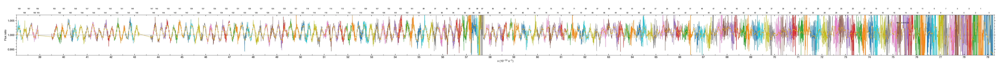
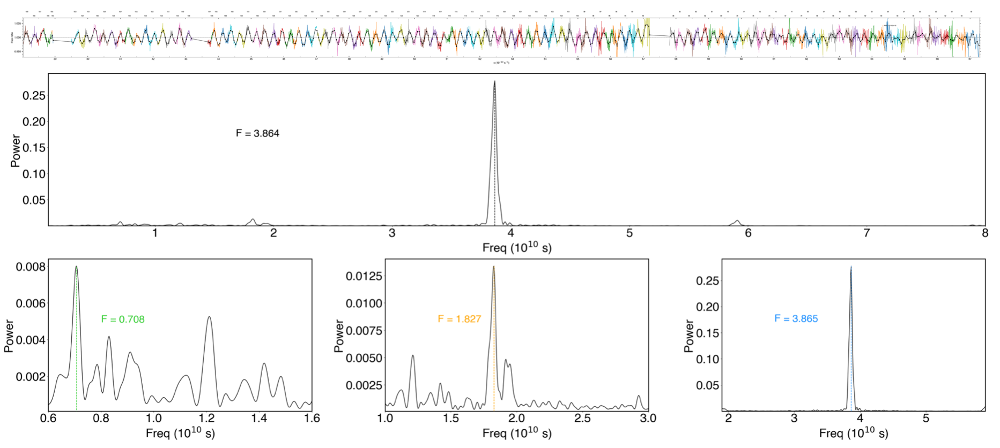
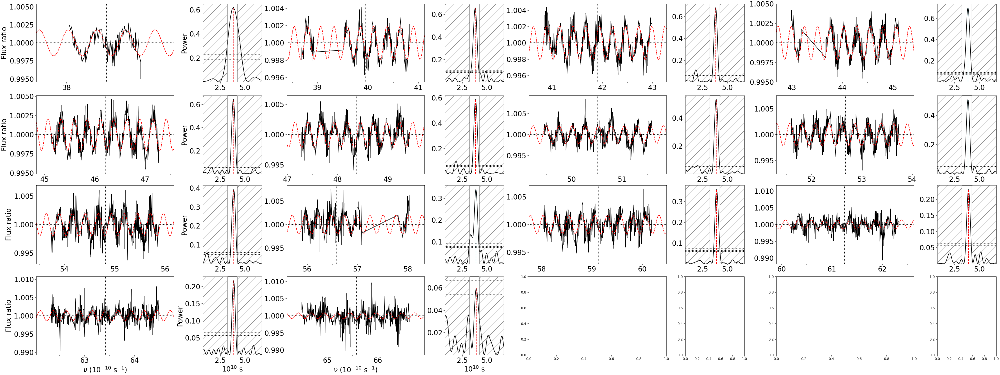
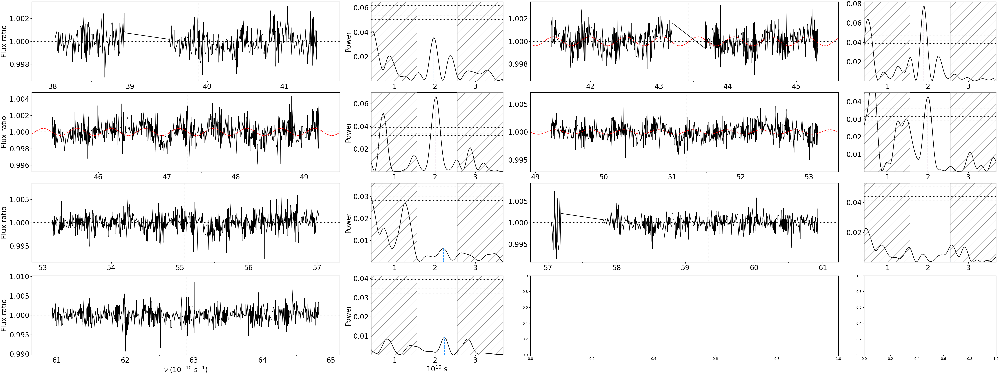
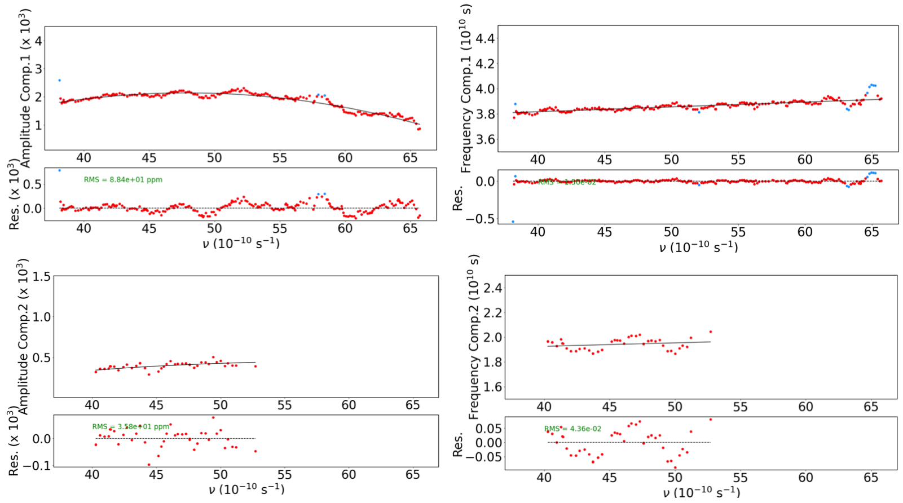

.. raw:: html

    

.. role:: orange

.. raw:: html

    

.. role:: green

.. raw:: html

    

.. role:: Magenta

Wiggle correction
=================

This tutorial is part of the `spectral reduction <https://obswww.unige.ch/~bourriev/antaress/doc/html/Fixed_files/procedures_reduc/procedures_reduc.html>`_ steps.

This module offers two methods to correct for the ESPRESSO *wiggles*, using either an analytical model over a full visit dataset (preferred approach), or a filter in each exposure. 
The analytical model describes a beat pattern between two sine-like components, which are dominating the wiggle pattern in most ESPRESSO datasets. Because this model only describes the wiggle signal and is constrained by all exposures, it prevents overfitting and provides a robust and homogeneous correction between ESPRESSO datasets.
The filter approach is more efficient and easier to set-up, but introduces the risk of overcorrecting planetary and stellar features at medium spectral resolution. It should be limited to observations in which the wiggle pattern is too complex to be captured with the analytical model.
 
Activate the ``ESPRESSO "wiggles"`` module (:green:`gen_dic['corr_wig']= True`) and set it to *calculation* mode (:green:`gen_dic['calc_wig'] = True`).

Initialization
--------------

Wiggles are processed as a function of light frequency (:math:`\nu = c/\lambda`), to be distinguished from the frequency `F` of the wiggle patterns.

TBD

Screening
---------

This step is common to both wiggle correction methods. It is used to identify the spectral ranges to be included in the analysis (i.e., where wiggles are larger than noise) and check which wiggle components affect your dataset.

Activate the screening submodule with :green:`gen_dic['wig_exp_init']= True`. You can leave the other submodule settings to their default value.

Plots of the spectral ratios between each exposure spectrum and a chosen master (ie, transmission spectra) are automatically saved in the :orange:`/Working_dir/Star/Planet_Plots/Spec_raw/Wiggles/Exp_fit/Instrument_Visit/Init/` directory.
As illustrated in :numref:`screening`, wiggles usually decrease in amplitude toward the blue of the spectrum, where the S/R also decreases (as the flux gets lower due to Earth diffusion and the black body of typical exoplanet host stars). You thus need to decide beyond which light frequency the transmission spectra do not bring any more constraints to the wiggle characterization. Here we chose :math:`\nu` = 6.73 nHz.   
Wiggles are also typically dominated by noise toward the center of the center of the spectrum (:math:`\nu \sim` 57-58 nHz) at the edges of the blue and red detectors.

.. Tip:: 
 Although this is not the case in this example, some datasets may display an additional wiggle pattern with lower frequency and localized S-shaped features (typically at :math:`\nu \sim` 47, 51, 55 :math:`10^13` Hz).
 The current version of the analytical model does not account for this pattern. You can exclude those S-shaped features to correct for the classical wiggles with the analytical model, and 
 ignore them (if they fall in a range you do not plan on analyzing) or correct them locally later on. Or you can use the filter approach, keeping in mind that you may overcorrect other signals of interest.   

  Transmission spectrum in one of the 20221117 exposures, as a function of light frequency. 
  The wiggle pattern is clearly visible, but dominated by noise at the center and blue end of the spectrum. The spectrum is colour coded by spectral order.

.. Erik
  can you redo this first figure with no excluded range at all ?

In general, you will see large noise levels at the 

From the transmission spectrum identify spectral ranges that are too noisy to be included in the fit::

 gen_dic['wig_range_fit'] = { 
            '20221117': [[20.,57.1],[57.8,67.3] ],   
            '20231106': [[20.,50.6],[51.1,54.2],[54.8,57.1],[57.8,67.3] ],         
        }

The final transmission spectrum with the excluded regions should show some clear periodic signals, as shown in :numref:`screening_final`.

  Final transmission spectrum after removing the noisy regions. Bottom the periodogram computed for all exposures from the observation.

Method 1: filter
-------------------------------------

After removing the noisy ranges the wiggle pattern should be clearly visible from the screening, if that is not the case the wiggle correction will not be applied. 
When the spectral ranges to be included have been defined you can charecatrise the wiggles using the filter approach. Choose values for 'win' and 'deg', that are fine enough to capture the wiggle pattern without fitting spurious features in the data.::

 gen_dic['wig_exp_filt']={
         'mode':True,
         'win':0.3,
         'deg':4,
         'plot':True
         }

`Finish the Filter method later`

Method 2: Analytical model
-------------------------------------

From previous analyses we have determined that the wiggles are best described as the sum of multiple sinusoidal components, and can be expressed as

:math:`W(\nu, t) = 1 + \sum _k A_k(\nu, t) \sin(2\pi \int (F_k(\nu,t)d\nu ) - \Phi_k(t)).`

In this module, we follow a few iterative steps to find the best parameters to fit the wiggle pattern. The first two components to estimate are the frequencies and amplitudes, :math:`F_k(\nu)` and :math:`A_k(\nu)`, expressed as

:math:`A_k (\nu, t) = \sum_{i=0}^{d_{a,k}} a_{\text{chrom},k,i}(t)(\nu - \nu_{\text{ref}})^i`,

:math:`F_k (\nu, t) = \sum_{i=0}^{d_{f,k}} f_{\text{chrom},k,i}(t)(\nu - \nu_{\text{ref}})^i`.

In an earlier step, the screening, you should have identified spectral regions that can be used to constrain the wiggle pattern and to asses the strength of the two components. The second step is to sample the chromatic variations in a set of exposures. Here, we sample the frequency and amplitude of the wiggle components with :math:`\nu`. Choose a selection of exposures to sample under the field `Exposures to be characterized`, for TOI-421 we sample every fifth exposure:
::
 if gen_dic['star_name']=='TOI421a':
     gen_dic['wig_exp_in_fit'] =  {
        '20221117':np.arange(0,28,5),
        '20231106':np.arange(0,54,5)
        }

For the chromatic sampling we use a sliding window over each transmission spectrum to identify the strongest peak in each window at every window position and fit a sine function to the window spectrum using the frequency of the strongest peak. In narrow bands, the wiggles can be approximated with constant frequencies, and in this step we sample the frequencies :math:`F_k(\nu)`, and amplitude :math:`A_k(\nu)` for each window position. The windows must be large enough to sample several periods of the frequency, further successive window positions will overlap to sample enough measurments. In the case for TOI-421 b, we used the following settings for the chromatic sampling of the first component.
::
 gen_dic['wig_exp_samp']={
     'mode':True,
     'comp_ids':[1],#[1,2] for sampling second component
     'freq_guess':{
         1:{ 'c0':3.72, 'c1':0., 'c2':0.},
         2:{ 'c0':2.05, 'c1':0., 'c2':0.},
            },
     'nsamp':{1:8,2:8}, 
     'sampbands_shifts':{1:np.arange(16)*0.15,2:np.arange(16)*0.3},
     'direct_samp' : {2:0,3:0},
     'nit':40,
     'src_perio' : {
         1:{'mod':'slide','range':[0.5,0.5] ,'up_bd':False  },
         2:{'mod':'slide','range':[0.5,0.5] ,'up_bd':True  },
            }
     'fap_thresh':5,
     'fix_freq2expmod':[],
     'fix_freq2vismod':{},
     'plot':True
     }

.. Note::
 Description of parameters and variables:

    + :green:`comp_ids` which component to analyse, start with the first component (the high frequency component), when the first component is analysed add the second component to the list. Once the first component is processed the piecewise model built from the windows is used to temporarily correct the transmission spectrum, and the second component will be sampled and analysed. See :numref:`samp_1` and :numref:`samp_2`, for the example of TOI-421 b.
    + :green:`freq_guess` is the polynomial coefficient describing the model frequency for each component. The models control the definition of the sampling bands.
    + :green:`nsamp` number of cycles to sample for each compojent in a given band, this is based on the guess frequency.
    + :green:`nsampbands_shifts` set the shifts for the window between samples.
    + :green:`direct_samp` (check this one with vincent)
    + :green:`nit` number of iterations in each band
    + :green:`src_perio` frequency ranges within which periodograms are searched for each component (in :math:`1e-10 s^{-1}`). Use :green:`{'mod':None}` for default search range. To define the search range use :green:`{'mod':'slide', 'range':[y,z]}`. Use :green:`'up_bd':True` to use the the higher component as the upper bound of the search window.
    + :green:`fap_thresh` wiggle in a band is fitted if the FAP is below this threshold (in %).
    + :green:`fix_freq2expmod` [compi_id] fixes the frequency of 'comp_id' using the fit results from 'wig_exp_point_ana'.
    + :green:`fix_freq2vismod` fixes the frequency of 'comps' using the fit results from :green:`'wig_vis_fit'` at the given path for each visit, format is :green:`{comps:[x,y] , vis1:path1, vis2:path2 }`.
    + :green:`plot` plot the sampled transmission spectra and band sample analyses.

  Sampling of the first component of TOI-421 b.

  Sampling of the second component of TOI-421 b, here the piecewise model built from the sampling of the first component has been corrected for.

Next part is the chromatic analysis. Here we analyse the frequecy and amplitude of each sample from the previous step and model them as polynomials of :math:`\nu`. In most cases, the frequency and amplitude can be described as linear or quadratic funcitons of :math:`\nu`. This step allow us to detemine which degree and guess values a that are suitible for the chromatic coefficients :math:`a_{\text{chrom},k,i}(t)` and :math:`f_{\text{chrom},k,i}(t)` in each sampled exposure. In the case of TOI-421 b, we used the following determine the chromatic coefficients for the frequency and amplitude for the 2 components.
::
 gen_dic['wig_exp_nu_ana']={
     'mode':True,
     'comp_ids':[1,2],
     'thresh':3.,
     'plot':True
     }
 gen_dic['wig_deg_Freq'][1] = 1
 gen_dic['wig_deg_Freq'][2] = 0
 gen_dic['wig_deg_Amp'][1] = 2
 gen_dic['wig_deg_Amp'][2] = 2

Where 

