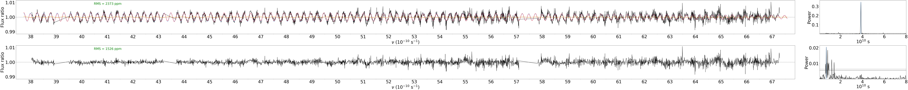
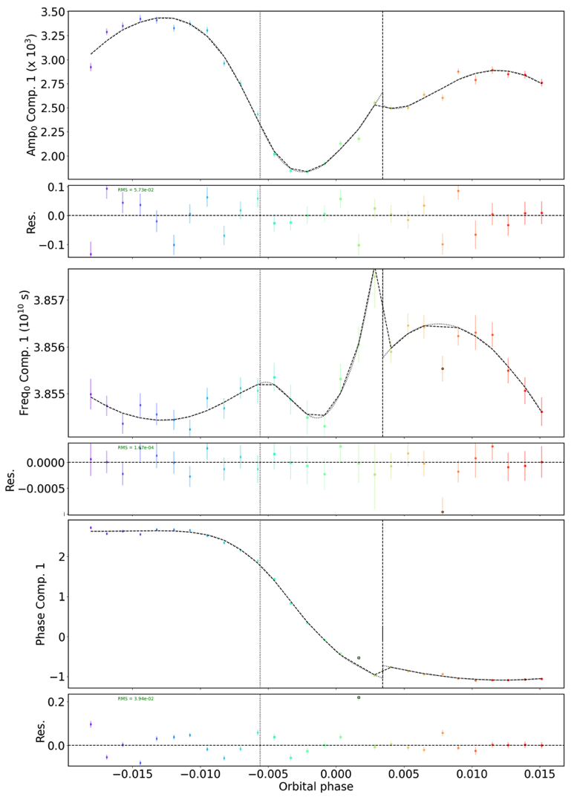

.. raw:: html

    

.. role:: orange

.. raw:: html

    

.. role:: green

.. raw:: html

    

.. role:: Magenta

Wiggle correction
=================

This tutorial is part of the `spectral reduction <https://obswww.unige.ch/~bourriev/antaress/doc/html/Fixed_files/procedures_reduc/procedures_reduc.html>`_ steps.

This module offers two methods to correct for the ESPRESSO *wiggles*, using either an analytical model over a full visit dataset (preferred approach), or a filter in each exposure. 
The analytical model describes a beat pattern between two sine-like components, which are dominating the wiggle pattern in most ESPRESSO datasets. Because this model only describes the wiggle signal and is constrained by all exposures, it prevents overfitting and provides a robust and homogeneous correction between ESPRESSO datasets.
The filter approach is more efficient and easier to set-up, but introduces the risk of overcorrecting planetary and stellar features at medium spectral resolution. It should be limited to observations in which the wiggle pattern is too complex to be captured with the analytical model.
 
Activate the ``ESPRESSO "wiggles"`` module (:green:`gen_dic['corr_wig']= True`) and set it to *calculation* mode (:green:`gen_dic['calc_wig'] = True`).

Initialization
--------------

Wiggles are processed as a function of light frequency (:math:`\nu = c/\lambda`), to be distinguished from the frequency `F` of the wiggle patterns. Here we go through the initialisation settings that are common for both the analytical and filter method. 

The wiggle corrections are applied on a visit-by-visit basis since the wiggle pattern is independent for each visit. To specify which visit to process, define the night to be processed by setting:
::
 gen_dic['wig_vis'] = ['20231106']

You can control how stellar master templates are applied during wiggle correction using the following settings:
    - :green:`'wig_indiv_mast'` (True/False) – Use an individual master for each exposure, default setting is set to False. In initial tests, enabling this setting did not significantly impact the wiggle correction.
    - :green:`'wig_merid_diff'` (True/False) – Use separate master templates for exposures taken before and after the meridian crossing. Helps account for changes in the wiggle pattern that may occur at the meridian crossing, where parameter derivatives in the wiggle function are reset. This option can be used if your dataset spans a meridian crossing and you suspect or see changes in the wiggle function around this point. Default setting is False.

If you have chosen to keep some bad exposures for analysis, but do not want them used in the construction of the stellar master, you can manually specify which exposures to include using the setting below, and to keep all exposures leave it empty.
::
 gen_dic['wig_exp_mast'] = {'20231106' : [exp0, exp1, ...]}

You can choose which spectral ranges and/or spectral orders to be characterised using the keys :green:`wig_range_fit` or based on spectral order :green:`wig_ord_fit`. This is further explained in the next section ``screening``. All spectra in this module are binned prior to the analysis. To analyse the first two main components the default value works well :math:`(\nu = 0.0166\, s^{-1})`. If you suspect or can identify additional wiggle components you may have to decrease the bin size used for binning at the cost of computational time.
::
 gen_dic['wig_bin'] = 0.0166

Screening
---------

This first step is common to both the analytical and filter correction approaches. It serves two purposes:

+ Identifying the spectral ranges to be included in the analysis (i.e., where wiggles are significant compared to noise)
+ Determine which wiggle components affect your dataset.

Activate the screening submodule with :green:`gen_dic['wig_exp_init']= {'mode': True}`. For initial tests, you can leave the other submodule settings at their default values. The additional options primarily control: which diagnostic plots are generated and the y-range used for the plotting of the wiggle amplitude. Default options generate all plots with an automatic selection of the y-range. 

Plots of the spectral ratios between each exposure spectrum and a chosen master (i.e., transmission spectra) are automatically saved in the :orange:`/Working_dir/Star/Planet_Plots/Spec_raw/Wiggles/Exp_fit/Instrument_Visit/Init/` directory.
As illustrated in :numref:`screening`, wiggles usually decrease in amplitude toward the blue of the spectrum, where the S/N also decreases (as the flux gets lower due to Earth diffusion and the black body of typical exoplanet host stars). You thus need to decide beyond which light frequency the transmission spectra do not bring any more constraints to the wiggle characterization. Here we chose :math:`\nu` = 6.73 nHz.
Wiggles are also typically dominated by noise toward the center of the center of the spectrum (:math:`\nu \sim` 57-58 nHz) at the edges of the blue and red detectors.

.. Tip:: 
 Although this is not the case in this example, some datasets may display an additional wiggle pattern with lower frequency and localized S-shaped features (typically at :math:`\nu \sim` 47, 51, 55 :math:`10^13` Hz).
 The current version of the analytical model does not account for this pattern. You can either ignore them, if they fall in a range you do not plan on analyzing, or follow the approach described in the next section.

.. figure:: wig_screening.png
  :width: 800
  :name: screening

  Transmission spectrum in one of the 20221117 exposures, as a function of light frequency. 
  The wiggle pattern is clearly visible, but dominated by noise at the center and blue end of the spectrum. The spectrum is colour coded by spectral order.

Based on the transmission spectrum shown in :numref:`screening`, an initial selection and identification of spectral ranges is performed. Exclude frequency regions that exhibit high noise levels relative to the wiggle amplitude. These regions should not be included in the wiggle model fit, as their contribution may degrade the overall correction quality.
::
 gen_dic['wig_range_fit'] = { 
            '20221117': [[20.,57.1],[57.8,67.3] ],   
            '20231106': [[20.,50.6],[51.1,54.2],[54.8,57.1],[57.8,67.3] ],         
        }

The final transmission spectrum with the excluded regions should show some clear periodic signals, as shown in :numref:`screening_final`.

.. figure:: screening.png
  :width: 800
  :name: screening_final

  Final transmission spectrum after removing regions with significant noise. The bottom panel shows the mean periodogram computed for all exposures from the observation.

After excluding spectral ranges with high noise levels, the wiggle pattern and associated peaks in the periodogram should become clearly visible, as shown in :numref:`screening_final`. 
If they remain indistinct, wiggles may be small enough that a correction is not required. 
Otherwise you can now deactivate this step (:green:`gen_dic['wig_exp_init']= False`) and move on to either the :ref:`filter <Wig_sec_filt>` or :ref:`analytical <Wig_sec_ana>` correction.

Method 1: filter
-------------------------------------

After removing noisy ranges, the wiggle pattern should be clearly visible in the screening. Once the spectral ranges to include are defined, characterise the wiggles using the filter approach. Select appropriate values for :green:`'win'` and :green:`'deg'`—fine enough to capture the wiggle pattern without overfitting spurious features. Determine suitable parameter values by inspecting the fits and corrections, evaluating potential overfitting, and analysing the signal in the power spectrum.
::
 gen_dic['wig_exp_filt']={
         'mode':True,
         'win':0.3,
         'deg':4,
         'plot':True
         }

A drawback of this approach is that it may smooth out spectral features and potentially remove signals of planetary or stellar origin. However, it is fast and easy to apply. Additionally, if unexpected features appear in the wiggle pattern that cannot be modeled analytically, this method allows you to isolate and correct those specific ranges. After addressing the abnormal features with the filter approach, you can then apply the analytical model to the remaining spectra.

Method 2: Analytical model
--------------------------

Previous analyses have shown that wiggles are best described as the sum of multiple sinusoidal components. The wiggle pattern can be expressed as:

:math:`W(\nu, t) = 1 + \sum _k A_k(\nu, t) \sin(2\pi \int (F_k(\nu,t)d\nu ) - \Phi_k(t)).`

This module follows an iterative approach to determine the best-fitting parameters for modeling the wiggle pattern. The first two key components to estimate is the wiggle frequency and amplitude, denoted as :math:`F_k(\nu)` and :math:`A_k(\nu)`, respectively. These are expressed as polynomial expansions:

:math:`A_k (\nu, t) = \sum_{i=0}^{d_{a,k}} a_{\text{chrom},k,i}(t)(\nu - \nu_{\text{ref}})^i`,

:math:`F_k (\nu, t) = \sum_{i=0}^{d_{f,k}} f_{\text{chrom},k,i}(t)(\nu - \nu_{\text{ref}})^i`.

The components are:

+ :math:`A_k(\nu,t)` represents the wiggle amplitude variation as a function of frequency and time.
+ :math:`F_k(\nu,t)` represents the wiggle frequency variation as a function of light frequency and time.
+ :math:`\nu_\text{ref}` is a reference light frequency used for normalization.
+ :math:`d_\text{a,k}` and :math:`d_\text{f,k}` defines the polynomial order for amplitude and frequency  variations.
+ The coefficients :math:`a_\text{chrom,k,i}(t)` and :math:`f_\text{chrom,k,i}(t)` describe the chromatic  dependence of the amplitude and frequency, respectively.
+ :math:`\Phi_k(t)` represents the phase shift of the sinusoidal comopnent at time :math:`t`.

When using the analytical model, the spectral orders must be normalized. If they are not centered around unity, enforce normalization by setting :green:`'wig_norm_ord'` to True. 

Two important events during the night will influence the wiggle pattern and its evolution:

+ Guide star change – Resets all parameters, introducing a discontinuity in the function at the time of the change.
+ Meridian crossing – Resets the derivatives while keeping the function continuous.

If a guide star change occurs during the night but the wiggle pattern remains continuous, you can avoid an unnecessary reset of the model parameters by including the night in the setting :green:`'wig_no_guidechange'`. This option is particularly useful in cases where only a small number of exposures are available on one side of the guide star change—making it difficult to independently characterize the wiggle parameters. It’s also important when the guide star switch happens near a meridian crossing, where allowing both a derivative and parameter reset in close succession can introduce too much flexibility into the model. You can assess whether this setting is appropriate by examining the data in Step 4: ``Pointing Analysis``. 

Since the wiggle model evolves slowly over time, exposures can be grouped or binned together to improve the fit and reduce noise. This can be done for several reasons, including:

+ Define exposure groups for analysis using :green:`'wig_exp_in_fit'` (see Step 1: ``Sampling Chromatic Variations`` for an example with TOI-421).
+ For low S/N data or the bluest spectral orders, where the wiggle component may be difficult to detect, boost S/N by grouping exposures and analyzing them together using :green:`'wig_exp_groups'`.
+ Adjust the spectral bin size with :green:`'wig_bin'`, choosing an appropriate size to resolve the dominant wiggle components (default settings work well for the two main components).

Step 1: Sampling Chromatic Variations
-------------------------------------
In the screening step you identified spectral regions that can be used to constrain the wiggle pattern and assess the strength of its components. 
In this step, activated with :green:`gen_dic['wig_exp_samp']['mode']= True`, you will sample the chromatic variations of the wiggle component across a representative set of exposures.
This means sampling the frequency and amplitude of each component as a function of light frequency :math:`\nu`.
 
First, select a set of exposures to sample using:: 

 gen_dic['wig_exp_in_fit'] =  {
    '20221117':np.arange(0,28,5),
    '20231106':np.arange(0,54,5)}
    

.. Tip:: 
 Since the wiggle pattern evolves relatively slowly with time, we do not need to sample their variations in every exposure.
 For the TOI-421 datasets, we thus sample one every fifth exposure.
 
In narrow bands, the wiggles can be approximated by a sine with constant frequency and amplitude.     
The sampling is thus performed automatically by sliding a fixed window over a given transmission spectrum, and at each sampled position:

+ Apply a periodogram to estimate the local wiggle frequency :math:`F_k(\nu)`.
+ Fit a sine function at this frequency to estimate the local wiggle amplitude :math:`A_k(\nu)`.
        
The window size must be large enough to include several oscillation cycles of the wiggle pattern. 
Furthermore, we recommend overlapping successive windows to sample more finely the wiggle pattern. 

This is an iterative process. Once the first component is processed, the piecewise model built over the sliding windows is used to temporarily correct the transmission spectrum (:numref:`samp_1`). 
The second component can then be sampled and analysed in the same way (:numref:`samp_2`).
We describe below the settings controlling this process, using the 20221117 visit as example.

Process the highest-frequency component by setting::

 gen_dic['wig_exp_samp']['comp_ids'] = [1]
 
Once this first component is analysed, you will correct it and process the second component by setting :green:`[1,2]`. 
You need to provide an estimate of each component frequency :math:`F_k(\nu)`, described as a polynomial with coefficients :green:`ci`:: 

 gen_dic['wig_exp_samp']['freq_guess']:{
         1:{ 'c0':3.72, 'c1':0., 'c2':0.},
         2:{ 'c0':2.05, 'c1':0., 'c2':0.}}   

Approximating :math:`F_k(\nu)` to a constant is usually sufficient for this step, and the above values should be similar for other datasets.
This guess frequency is also used to calculate the width of the sliding window, which is set by the number of cycles you want to sample for each component::

 gen_dic['wig_exp_samp']['nsamp'] = { 1 : 8 , 2 : 8 } 

The oversampling of the sliding windows is controlled by shifts in :math:`\nu` (in :math:`10^13 s^{-1}`) set as::

 gen_dic['wig_exp_samp']['sampbands_shifts'] = {
     1:np.arange(16)*0.15,
     2:np.arange(16)*0.30 }

The pipeline loops over the shifts, positions the first window at the lowest :math:`\nu` of the spectrum plus the shift, and then slides the window over consecutive (non overlapping) positions.
When processing the second component, the first one is corrected for using the piecewise model built over the sliding windows positioned for a given shift, whose index within :green:`sampbands_shifts` is set as:: 

 gen_dic['wig_exp_samp'][2] = 0

Periodograms associated with each window are searched for the peak wiggle frequency over a broad default range (:green:`'mod':None`), or within a range (in :math:`10^13 s^{-1}`) centered on the guess :math:`F_k(\nu)` for this window::

 gen_dic['wig_exp_samp']['src_perio']={
         1:{'mod':'slide','range':[0.5,0.5] ,'up_bd':False },
         2:{'mod':'slide','range':[0.5,0.5] ,'up_bd':True  }}

Where :green:`'up_bd':True` restricts the range upper boundary for the second component to the first component frequency.
The sine fit is then only performed in the window if the FAP of its peak periodogram frequency is below a threshold (in \%)::

 gen_dic['wig_exp_samp']['fap_thresh'] = 5
 
To better converge on the sine fit it is repeated iteratively :green:`gen_dic['wig_exp_samp']['nit']` times. 

You can improve the quality of the sampling after having completed :ref:`Step 3 <Wig_sec_ana3>`, by fixing the frequency of the components (here the first) to its value from the best-fit model in each exposure::

 gen_dic['wig_exp_samp']['fix_freq2expmod'] = [1]

And after having completed :ref:`Step 5 <Wig_sec_ana3>`, by fixing the frequency of the components to their values from the best-fit model in each visit (stored at a given path)::

 gen_dic['wig_exp_samp']['fix_freq2vismod'] = { 
     comps:[1,2] , 
     '20221117' : 'path1/Outputs_final.npz', 
     '20231106' : 'path2/Outputs_final.npz' }

The :green:`gen_dic['wig_exp_samp']['plot']` field plots the sampled transmission spectra and sampling analyses, stored under :orange:`/Working_dir/Star/Planet_Plots/Spec_raw/Wiggles/Exp_fit/Instrument_Visit/Sampling/`.

.. figure:: wiggle_sampling_1.png
  :width: 800
  :name: samp_1

  Sampling of the first wiggle component in the 20221117 visit.

.. figure:: wiggle_sampling_2.png
  :width: 800
  :name: samp_2

  Sampling of the second wiggle component in the 20221117 visit. The piecewise model built from the sampling of the first component has been corrected for.
  
You can now deactivate this step (:green:`gen_dic['wig_exp_samp']['mode']= False`) and move on to the next one.

Step 2: Chromatic analysis
-------------------------------------
In this step, we analyze the frequency and amplitude of the wiggles for the sampled exposures from the previous step. We model them as polynomials of :math:`\nu`. To perform the fit, activate this module by setting :green:`gen_dic['wig_exp_nu_ana']['mode']= True`.

In most cases, both the wiggle frequency and amplitude can be well described using linear or quadratic functions of :math:`\nu`. This step helps determine the appropriate polynomial degree and initial guess values for the chromatic coefficients, :math:`a_{\text{chrom},k,i}(t)` and :math:`f_{\text{chrom},k,i}(t)`, in each sampled exposure. You can select which components to characterize using the setting :green:`gen_dic['wig_exp_nu_ana']['comp_ids']`. The number of components will depend on how many were detected in the earlier steps.

To improve the fit, you can also exclude outliers using the :green:`'thresh'` keyword. After running this submodule once, excluded outliers will be identified and can be visually confirmed. For example, in the case of the night 20221117, excluded data points are shown as blue dots in :numref:`chrom_ana`.

To find the most appropriate polynomial degree, it’s recommended to test different values and manually inspect the diagnostic plots. These plots are automatically saved in :orange:`/Working_dir/Star/Planet/Spec_raw/Wiggles/Exp_fit/Instrument_Visit/Chrom/`.

As an example, we used the following settings for TOI-421 for the night 20221117 to determine the chromatic coefficients for frequency and amplitude for the two wiggle components:
::
 gen_dic['wig_exp_nu_ana']={
     'mode':True,
     'comp_ids':[1,2],
     'thresh':3.,
     'plot':True
     }

 gen_dic['wig_deg_Freq'][1] = 1 
 gen_dic['wig_deg_Freq'][2] = 0 
 gen_dic['wig_deg_Amp'][1] = 2  
 gen_dic['wig_deg_Amp'][2] = 2  

.. Note::
 Parameter descriptions:

    + :green:`comp_ids` components to be analysed.
    + :green:`thresh` threshold for automatic exclusion of outliers.

    + :green:`wig_deg_Freq` polynomial degree for Frequency component [n].
    + :green:`wig_deg_Amp` polynomial degree for Amplitude component [n].

.. figure:: chrom_ana.png
  :width: 800
  :name: chrom_ana

  Chromatic analysis of the first and second wiggle components for amplitude and frequency. The first component of the amplitude is best described as a second-degree polynomial of frequency (top left panel), while the second component is modeled as a linear function of frequency (bottom left panel). The right panel shows the wiggle frequency as a function of frequency for the first and second components, both modeled using linear relations.

By examining the chromatic analysis plots, you can spot spectral regions that are poorly fitted, these typically show up as sudden jumps or deviations in the sampled values over narrow frequency intervals. Such features are a result of the sliding window sampling method and often signal areas that require further refinement or may need to be excluded from the model.

At this stage, it is useful to:

+ Review the initial screening and fitting steps to ensure an accurate selection of spectral ranges before proceeding.
+ Continue to the next step, Exposure Fit, to assess how well the model performs across different spectral regions, particularly where the chromatic analysis showed significant variations.

.. Tip:: 
 For the bluest spectral orders, a higher polynomial degree is sometimes needed, which can be difficult to detect in this submodule. Accurate modeling and correction in these regions may require additional flexibility. This is best evaluated during the next step, ``Exposure Fit``.

You can now deactivate this step (:green:`gen_dic['wig_exp_nu_ana']['mode']= False`), and move on to the next one.

Step 3: Exposure fit
---------------------

In this step, the spectral wiggle model :math:`W(\nu)` is initialized using the results from the previous step and calculated independently for each exposure. This provides more accurate estimates of the chromatic coefficients :math:`a_{\text{chrom},k,i}(t)`, :math:`f_{\text{chrom},k,i}(t)`, and the phase shift :math:`\Phi(t)`. Activate this submodule by setting :green:`gen_dic['wig_exp_fit']['mode'] = True`.

Some options in this step rely on the model derived in the subsequent step. For the first run, these options should be left empty. It is best to use an iterative approach between this and the next step (Step 4). 

To initialize the fit using values derived in the precious step, set :green:`gen_dic['wig_exp_fit']['init_chrom']=True`. Running :green:`wig_exp_samp` on representative exposures that sample wiggle variations is sufficient. Make sure the chromatic analysis is used with the same components as used here. If you decide to not use values derived in the previous step you can define the guess frequency for each component with the setting :green:`'freq_guess'`. Further keywords for the setting concerns the fitting procedure with: :green:`nit`, number of iterations, :green:`fit_method` either 'leastsq' or 'nelder' if convergence is difficult to reach, :green:`use` to calculate or retrieve fits.

You can use priors on fitted parameters by indicating the parameter and boundaries as:
::
 gen_dic['wig_exp_fit']['prior_par']['vis'] = {'par0': [min, max], 
                                               'par1': [min, max]}

By using the next submodule ``Pointing analysis`` you can further constrain the model by using the values derived as priors or as fixed values. With the model from the next step ``Pointing analysis`` you can either keep values fixed to their model value using:
::
 gen_dic['wig_exp_fit']['fixed_pointpar']['vis'] = [prop0, prop1,...]

Or you can use the model derived and base your priors around it as:
::
 gen_dic['wig_exp_fit']['model_par']['vis'] = {par : [-val, +val]}

Which is interpreted as the interval around the model for each parameter defined here. To asses the model and correction plots are automatically saved in :orange:`/Working_dir/Star/Planet/Spec_raw/Wiggles/Exp_fit/Instrument_Visit/Global/`.

Combining the submodules ``Exposure fit`` and ``Pointing analysis`` we used the following settings and priors for TOI-421 night 20221117.
::
 gen_dic['wig_exp_fit']={
    'mode':False, 
    'comp_ids':[1,2], 
    'init_chrom':True,
    'freq_guess':{
        1:{ 'c0':3.8, 'c1':0., 'c2':0.},
        2:{ 'c0':2.0, 'c1':0., 'c2':0.}
        },
    'nit':20, 
    'fit_method':'leastsq', 
    'use':True,
    'fixed_pointpar':{},
    'prior_par':{},
    'model_par':{},
    'plot':True,
    }
 
 gen_dic['wig_exp_fit']['model_par']['20221117']={
            'AmpGlob1_c0':[0.3e-4,0.3e-4],
            'AmpGlob1_c1':[0.3e-5,0.3e-5],
               'Freq1_c0':[0.0004,0.0004],
               'Freq1_c1':[0.00025,0.00025],
               'Freq2_c0':[0.02,0.02],
                   'Phi1':[0.1,0.1],
                   'Phi2':[0.5,0.5],
        }

By applying the model and analyzing the resulting corrections, you can assess the model’s performance before moving on to the next step. If you still notice prominent spikes in the periodogram after applying the correction, it's a good idea to examine the areas where the model fails. In some datasets, using a higher-degree polynomial in the chromatic analysis may be necessary to achieve a better fit in the higher-frequency range and improve the correction of the wiggle pattern.

  Exposure fit example for the visit on 20221117: The periodogram at the top shows a strong peak, which disappears in the residuals after the correction.

The resulting plots are automatically saved in: :orange:`/Working_dir/Star/Planet/Spec_raw/Wiggles/Exp_fit/Instrument_Visit/Global/`. You can now deactivate this step (:green:`gen_dic['wig_exp_fit']['mode']= False`), and move on to the next one.

Step 4: Pointing Analysis
-------------------------------------

In this step, each parameter fitted during the ``Exposure Fit`` is evaluated as a time series and modeled against the telescope’s pointing coordinates. This allows us to characterize the pointing-dependent terms in the final model, including the chromatic coefficients :math:`a_{\text{point},k,i}(t)` and :math:`f_{\text{point},k,i}(t)`, as well as the phase shift :math:`\Phi_{\text{point},k,i}`. The model derived here can also be used directly as priors using the :green:`'model_par'` option, or use the model to find appropriate priors, additionally you can fix values for parameters for an additional run of the ``Exposure Fit``, making it useful to iterate between these two steps to refine the parameters and achieve model convergence. To calculate the model for the pointing of the telescope activate the submodule :green:`gen_dic['wig_exp_point_ana']['mode'] = True`.

The evolution of the first component for amplitude, frequency, and phase shift can be seen in :numref:`pointing_analysis`, for TOI-421 night 20221117. A key feature of this model is the discontinuity that occurs at the time of a guide star change. This event is explicitly accounted for in the model, as all parameters are reset at the moment of the guide star switch. Because this discontinuity can significantly affect the wiggle modeling, it is best examined at this stage.

However, in some datasets the discontinuity may be negligible or occur near the beginning or end of the observation window. In such cases, it may be appropriate to deactivate the parameter reset by including the night in the :green:`'wig_no_guidechange'` field at the start of the wiggle module.

For the fitting procedure, you can select the source of the fitting coefficients—either from the Exposure Fit results by setting :green:`'glob'`, or from the sampling results using :green:`'samp'`. At this stage, it may also be beneficial to include more exposures in the fit by removing the initial grouping applied at the beginning of the module. This can be done using the :green:`'wig_exp_in_fit'` field. However, note that changing the set of exposures in this way requires re-running Step 3: Exposure Fit, which will increase computational time. Despite the added cost, fitting the model using the full set of exposures may be necessary to achieve optimal results.

Additional tools to improve the pointing model include:

+ Automated outlier removal, which can be enabled by setting a threshold with :green:`'thresh'`
+ Skipping undefined parameters using :green:`'fit_undef'`
+ Specifying a custom range for fitting particular parameters or visits, using::
 gen_dic['wig_exp_point_ana']['fit_range'] = {vis : {par :[low, high]}}

For parameters that show poor convergence or no clear trend with the pointing coordinates, you can fit them as constants by listing them in the :green:`'stable_pointpar'` field. This is especially useful for stabilizing the model when certain components do not exhibit meaningful time or pointing dependence.

..
 Vincent, this one is optional, depending on if this will remain an issue or not
Keep in mind that the amplitude and phase values are degenerate and periodic with :math:`\pi`, which can lead to apparent discontinuities in the phase plots. These discontinuities often arise when the final model value includes a phase shift that is an integer multiple of :math:`\pi`. When this happens, the corresponding amplitude values will also show a sign flip if the phase shift involves an odd multiple of :math:`\pi`, which inverts the sign of the amplitude for that data point in the model. To automatically correct for this effect, you can activate the option :green:`'conv_amp_phase'`, which adjusts the amplitude sign based on the detected phase discontinuities.

.. Tip:: 
   The pointing analysis is based on the parameters derived in the previous step, ``Exposure Fit``. Once you have a model for the pointing analysis, you can further refine the model by using it as the basis for your priors in the exposure fit. Model priors are calculated from the model :math:`v(t)` as :math:`[v(t) - \text{model_par}[0], v(t) + \text{model_par}[1]]`. By analyzing the model (see :numref:pointing_analysis) for each component, you can adjust the constraints for the priors until you achieve a good model and fit.

   Here is how priors and the model priors were set up for the analysis of night 20221117:   
   ::
     gen_dic['wig_exp_fit']['prior_par']['20221117']={
            'AmpGlob2_c0':{'low':-4e-3,'high':4e-3},
            'AmpGlob2_c2':{'low':-1e-7,'high':1e-7},
               'Freq1_c0':{'low':3.84,'high':3.8575},
               'Freq2_c0':{'low':1.7,'high':2.2},
                   'Phi2':{'low':-30.,'high':30.},
        }  
    gen_dic['wig_exp_fit']['model_par']['20221117']={ 
            'AmpGlob1_c0':[0.3e-4,0.3e-4],
            'AmpGlob1_c1':[0.3e-5,0.3e-5],
               'Freq1_c0':[0.0004,0.0004],
               'Freq1_c1':[0.00025,0.00025],
               'Freq2_c0':[0.02,0.02],
                   'Phi1':[0.1,0.1],
                   'Phi2':[0.5,0.5],
        }

  Pointing analysis displaying the time evolution of the main component of the three functions :math:`a_{\text{point},k,i}(t)`, :math:`f_{\text{point},k,i}(t)`, and :math:`\Phi_{\text{point},k,i}`. The gray vertical dashed line indicates the pointing passing the meridian and the vertical black dashed line represents a change of guide star. You can further see how the model changes behaviour around these two points, where the change of guide star introduces a discontinuity in the model.

The resulting plots are automatically saved in: :orange:`/Working_dir/Star/Planet_Plots/Spec_raw/Wiggles/Exp_fit/Instrument_Visit/Coord/`.

+ The model derived in this step can be used to create model priors with a uniform distribution around the model value for each exposure when recomputing the exposure fit.
+ The vertical lines in the pointing analysis represent critical time steps in the pointing and wiggle model.
    + When passing the meridian, the derivatives of the model parameters reset completely.
    + The change of guide star results in a complete reset of model parameters unless the option :green:`gen_dic['wig_no_guidchange']` is used to ignore this reset.

You can now deactivate this step (:green:`gen_dic['wig_exp_point_ana']['mode']= False`), and move on to the next one.

Step 5: Global / visit fit
-------------------------------------
TBD

..
 The full spectro-temporal wiggle model :math:`W(\nu, t)` is initialized using the results from the previous step and fitted to all exposures simultaneously. Due to the large number of free parameters and the  complexity of a model composed of cumulative sine functions, it is crucial to provide guess values close to the best-fit solution to ensure proper convergence.
 ::
  gen_dic['wig_vis_fit']={
      'mode':False ,
      'fit_method':'leastsq',   
      'wig_fit_ratio': False,
      'wig_conv_rel_thresh':1e-5,
      'nit':15,
      'comp_ids':[1,2],
      'fixed':False, 
      'reuse':{},
      'fixed_pointpar':[],      
      'fixed_par':[],
      'fixed_amp' : [],
      'fixed_freq' : [],
      'stable_pointpar':[],
      'n_save_it':1,
      'plot_mod':True    ,
      'plot_par_chrom':True  ,
      'plot_chrompar_point':True  ,
      'plot_pointpar_conv':True    ,
      'plot_hist':True,
      'plot_rms':True ,
      }
 
  # Fields below are only relevant if nested sampling is used for parameter estimation ('fit_method' = 'ns')
  gen_dic['wig_vis_fit']['ns'] = {        
      'nthreads': int(0.8*cpu_count()), ### number of threads for nested sampling
      'run_mode': 'use',
      'nlive': {}, # If empty (nlive = 50 * N_free)
      'reboot':''
  }
 
 
 .. Note::
   Parameter descriptions:
 
     + :green:`fit_method` specifies the optimization method to use for fitting:
         + 'leastsq': Fast and sufficient if the initialization is correct.
         + 'nelder': More robust but slower, useful when convergence is difficult.
         + 'ns': Uses nested sampling (currently under development).
     + :green:`nit` number of fit iterations to perform. A higher value allows for better convergence but increases computation time.
     + :green:`comp_ids` nefines which model components to include in the fit. This allows selecting specific terms of the model to optimize.
     + :green:`fixed` determines whether the model parameters are kept fixed during fitting:
         + True: The model remains fixed to the initialization or previous fit results.
         + False: The parameters are free to vary during fitting.
     + :green:`reuse` specifies whether to reuse a previous fit file:
         + {}: No reuse.
         + Path to a fit file: The file is retrieved for post-processing (fixed=True) or used as an initial guess (fixed=False).
     + :green:`fixed_pointpar` list of pointing parameters that should remain fixed during the global fit.
     + :green:`fixed_par` list of general model parameters that should remain fixed during the fit.
     + :green:`fixed_amp` specifies a list of components whose amplitudes should remain fixed during fitting.
     + :green:`fixed_freq` specifies a list of components whose frequencies should remain fixed during fitting.
     + :green:`stable_pointpar` list of pointing parameters that should be fitted with a constant value instead of varying across exposures.
     + :green:`n_save_it` frequency at which fit results are saved (every n_save_it iterations). Helps track progress and recover data in case of interruptions.
     + :green:`plot_hist` generates a cumulative periodogram over all exposures to visualize residual periodic structures before and after correction.
     + :green:`plot_rms` plots the RMS (root mean square) of pre/post-corrected data over the entire visit to assess the effectiveness of the correction.
 

Step 6: Applying the correction
-------------------------------------
In this step, the spectro-temporal wiggle model correction is applied to the data. This correction uses the model derived from the ``global fit`` and applies it across the relevant spectral range(s) and exposures.

This step must be applied regardless of whether you are using the filter method or the analytical method for the final correction.
::
 gen_dic['wig_corr'] = {
     'mode':False,
     'path':{},
     'exp_list':{},
     'comp_ids':[1,2],
     'range':{},
     }

.. Note::
  Parameter descriptions:

    + :green:`mode` enables or disables the correction step. Set to True to apply the correction.
    + :green:`path` specifies the path to the correction file for each visit. If left empty ({}), the most recent result from :green:`'wig_vis_fit'` is used. Result files from ``Global fit`` are stored in: :orange:`/working_dir/Star/Planet/Corr_data/Wiggles/Vis_fit/Instrument_Visit/`. Format used is: :green:`'path':{'visit':'file_path'}`.
    + :green:`exp_list` defines which exposures to correct for each visit. If left empty ({}), the correction is applied to all exposures.
    + :green:`comp_ids` list of components to include in the correction. These components must be present in the global fit model (wig_vis_fit).
    + :green:`range` specifies the spectral range(s) (in Å) over which the correction should be applied. If left empty ({}), the correction is applied to the full spectrum.

To visually assess the correction, use the plotting dictionary :green:`plot_dic['trans_sp']` to check the transmission spectra. Ensure that the wiggle patterns have been properly removed. In the ``plot_settings`` file, under :green:`'trans_sp'`, set :green:`['plot_pre']='cosm'` to plot the spectrum before the correction (after cosmic correction), and :green:`['plot_post']='wig'` to plot the spectrum after the wiggle correction.

