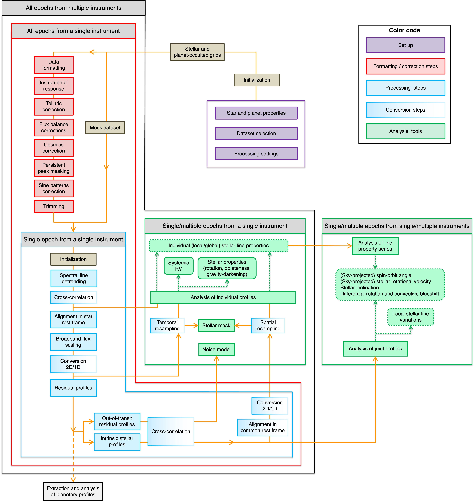

.. raw:: html

    

.. role:: orange

.. raw:: html

    

.. role:: green

.. raw:: html

    

.. role:: Magenta

Getting started
===============

Flowchart
---------

  
  Chart of the ``ANTARESS`` process flow.

General approach
----------------

Follow these steps to run ``ANTARESS``:  

1. Create a working directory and copy the following configuration files inside:   

- `ANTARESS_systems.py <https://gitlab.unige.ch/bourrier/antaress/-/blob/main/src/antaress/ANTARESS_launch/ANTARESS_systems.py>`_: to define the system properties for the host star and its planets. 
  The default file contains a mock system as example, but you will certainly want to define your target one !  

- `ANTARESS_settings.py <https://gitlab.unige.ch/bourrier/antaress/-/blob/main/src/antaress/ANTARESS_launch/ANTARESS_settings.py>`_: to define your input datasets, and the modules to process and analyze them. 
  Although the default file allows running the workflow with minimal intervention, any detailed analysis will require that you define your own settings.

- `ANTARESS_plot_settings.py <https://gitlab.unige.ch/bourrier/antaress/-/blob/main/src/antaress/ANTARESS_plots/ANTARESS_plot_settings.py>`_: to define the settings controlling the plots from the workflow (see below).

2. Move to the working directory and run the workflow from terminal with the command::

    antaress --custom_systems ANTARESS_systems.py --custom_settings ANTARESS_settings.py --custom_plot_settings ANTARESS_plot_settings.py

   Alternatively you can run the workflow from your python environment as::
	
	from antaress.ANTARESS_launch.ANTARESS_launcher import ANTARESS_launcher
	ANTARESS_launcher(custom_systems = 'ANTARESS_systems.py' , custom_settings = 'ANTARESS_settings.py' , custom_plot_settings = 'ANTARESS_plot_settings.py')
	
   You can also run the workflow from any location by setting the option :green:`working_path` to the path of your working directory.
   
   If you do not define one of the configuration files, the workflow will use the default one downloaded with the package. 

3. Processed data and fit results will be saved in a sub-directory :orange:`PlName_Saved_data` of the working directory, where :orange:`PlName` is the name of the planet(s) you defined in :orange:`ANTARESS_systems.py`.    
   
   Plots will be saved in a sub-directory :orange:`PlName_Plots`.

Modules
-------

The workflow is organized as modules, which are grouped in three main categories (see :magenta:``Flowchart figure`` above):

- ``Formatting/correction``: Data first go through these modules, some of which are specific to given instruments. Once data are set in the common ``ANTARESS`` format and corrected for instrumental/environmental effects, they can be processed in the same way by the subsequent modules. 

- ``Processing``: The second group of modules are thus generic and aim at extracting specific types of spectral profiles, converting them in the format required for the analysis chosen by the user.

- ``Analysis``: The third group of modules allow fitting the processed spectral profiles to derive quantities of interest. 

``Formatting/correction`` and ``Processing`` modules are ran successively, ie that data need to pass through an earlier module before it can be used by the next one. ``Analysis`` modules, in contrast, are applied to the outputs of various ``Processing`` modules throughout the pipeline. 

Each module can be activated independently through the configuration file :orange:``ANTARESS_settings.py``. Some of the ``Formatting/correction`` and ``Processing`` modules are optional, for example the ``Telluric correction`` module for space-borne data or the ``Flux scaling`` module for data with absolute photometry. Some modules are only activated if the pipeline is used for a specific goal, for example the ``CCF conversion`` of stellar spectra when the user requires the analysis of the Rossiter-McLaughlin effect.

In most modules you can choose to compute data (`calculation mode`, in which case data is saved automatically on disk) or to retrieve it (`retrieval mode`, in which case the pipeline checks that data already exists on disk). This approach was mainly motivated by the fact that keeping all data in memory is not possible when processing S2D spectra, so that ``ANTARESS`` works by retrieving the relevant data from the disk in each module. 

Plots
-----

Plots are generated `at the end` of the workflow processing, upon request.

At the end of each module in the main configuration file :orange:`ANTARESS_settings.py` you can activate a given :orange:`plot_name` by setting :orange:`plot_dic['plot_name']` to an extension, such as :orange:`pdf`.

Some plots require specific outputs, which are not produced by default due to their large size. This means that if you activate a plot after running the workflow once and retrieving its results, it may not compute. You will simply have to run the workflow again in `calculation mode` for the relevant modules.

The plot settings are then controlled through the plot configuration file :orange:`ANTARESS_plot_settings.py`. All plots have default settings, but a large number of options are available so that you can adjust the plot contents and their format.