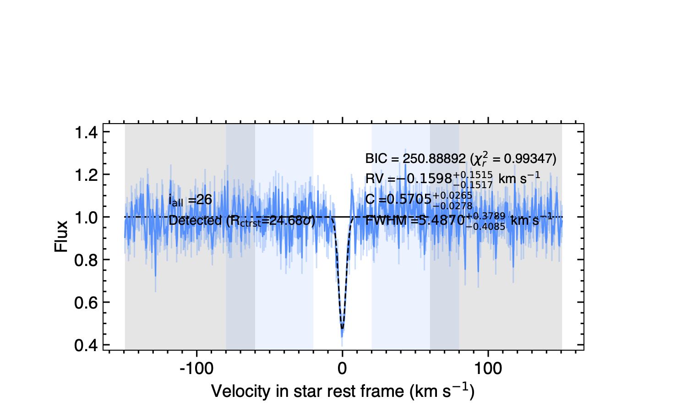
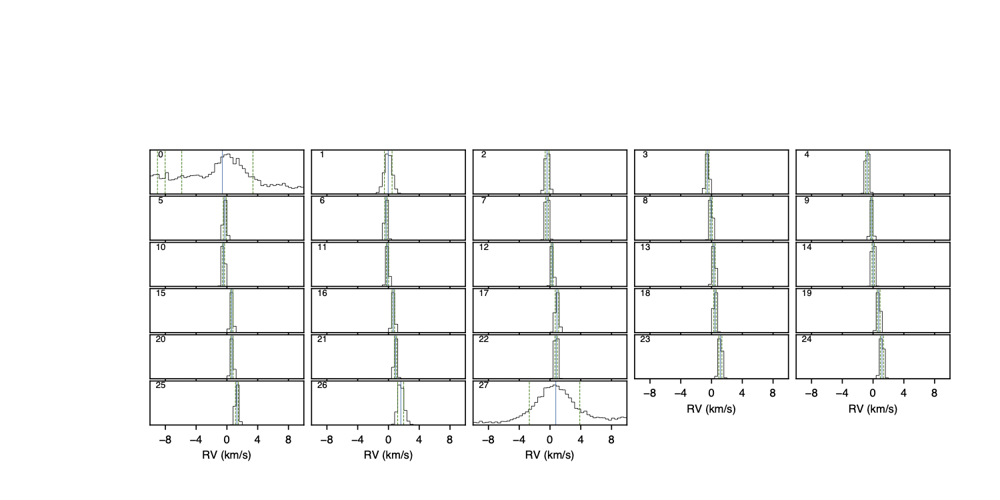
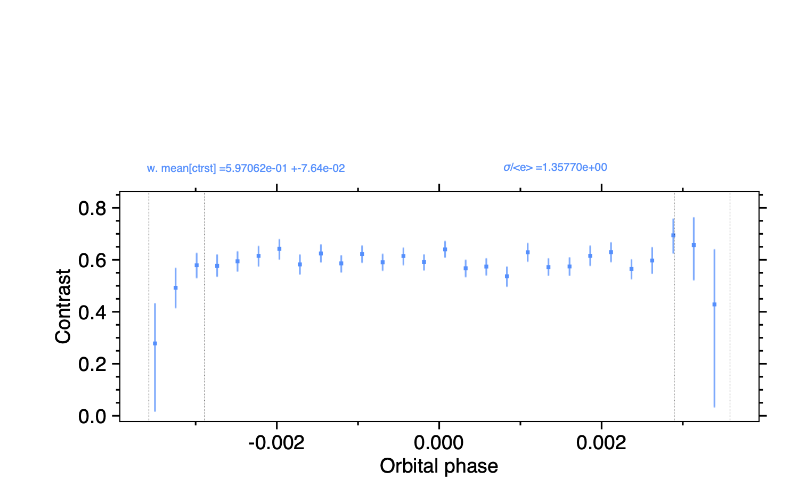
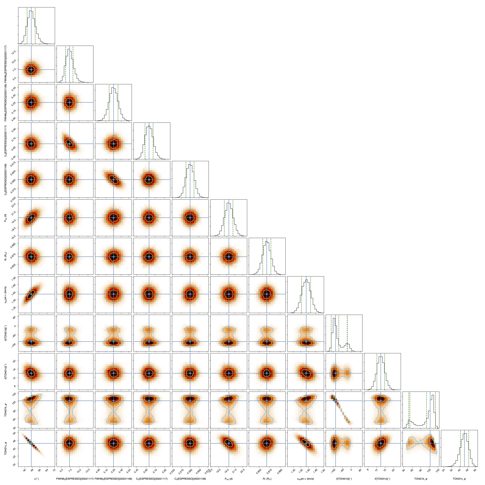
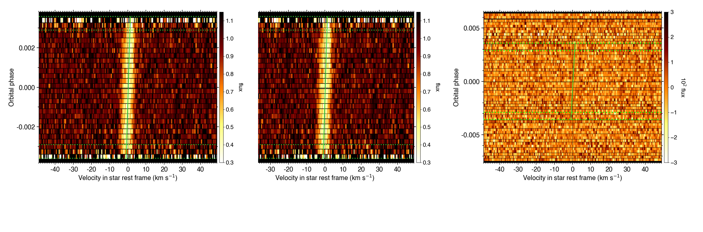
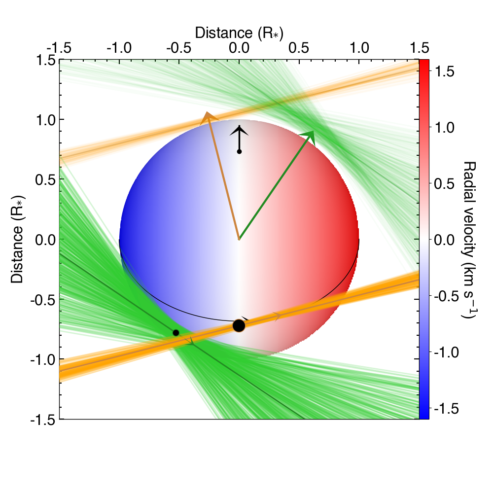

.. raw:: html

    

.. role:: orange

.. raw:: html

    

.. role:: green

.. raw:: html

    

.. role:: Magenta

Rossiter McLaughlin analysis
============================

``ANTARESS`` tutorials detail how to use the configuration file (which you should have copied in your working directory from the `default configuration file <https://gitlab.unige.ch/spice_dune/antaress/-/blob/main/src/antaress/ANTARESS_launch/ANTARESS_settings.py>`_) to carry out a specific procedure. 
Additional options are typically available in this file, so do not hesitate to read it in details. 
``ANTARESS`` plots are activated via the configuration file and have default settings, which can be extensively customized through the plot configuration file (which you should also have copied in your working directory from the `default plot configuration file <https://gitlab.unige.ch/spice_dune/antaress/-/blob/main/src/antaress/ANTARESS_plots/ANTARESS_plot_settings.py>`_)

The present tutorial relates to the analysis of Rossiter McLaughlin (RM) signals from transiting planets, using the *Revolutions* technique (`Bourrier et al. 2021 <https://www.aanda.org/articles/aa/full_html/2021/10/aa41527-21/aa41527-21.html>`_). 
We illustrate the tutorial with ESPRESSO observations of TOI-421b (on 2022-11-17) and TOI-421c (on 2023-11-06). 
Before starting, let us highlight the interest of using this technique and applying it through ``ANTARESS``.
The Revolutions technique exploits the spectral profiles of the planet-occulted stellar lines, in contrast to the *classical* and *Reloaded* techniques that exploit the RV centroids of the disk-integrated and planet-occulted stellar lines, respectively.
The three techniques give comparable results when the RM signal is significant (eg, for bright stars and large transit depths), the occulted stellar lines Gaussian, and the scale of their spatial variations from center-to-limb variations and photospheric RV motions small compared to the planet orbital motion during an exposure (ie, blurring is negligible).   
When these conditions are not met the Revolutions technique improves the detectability of the RM signal and reduces biases, because it fits the spectro-temporal variations of the occulted lines with a numerical model of the stellar photosphere. This allows simulating complex line profiles and photospheric variations, and accounting for the aforementioned blurring.

We assume that you have already `set up your system <https://obswww.unige.ch/~bourriev/antaress/doc/html/Fixed_files/procedures_setup/procedures_setup.html>`_, `reduced <https://obswww.unige.ch/~bourriev/antaress/doc/html/Fixed_files/procedures_reduc/procedures_reduc.html>`_ and `processed <https://obswww.unige.ch/~bourriev/antaress/doc/html/Fixed_files/procedures_proc/procedures_proc.html>`_ your spectral transit time-series, 
extracted the `planet-occulted stellar profiles <https://obswww.unige.ch/~bourriev/antaress/doc/html/Fixed_files/procedures_extraction/procedures_extraction.html>`_, and converted them into `intrinsic CCFs <https://obswww.unige.ch/~bourriev/antaress/doc/html/Fixed_files/procedures_CCF/procedures_CCF_Intr/procedures_CCF_Intr.html>`_.

.. _RM_sec_intr:

Analysis of individual intrinsic lines
--------------------------------------

The goal of this step is to fit a model line profile to each intrinsic CCF in order to derive time-series of line properties. Those will be used to identify which exposures should be included in the RM Revolutions fit, and what are the best models to be used.
Activate the ``Intrinsic profiles analysis`` module (:green:`gen_dic['fit_Intr'] = True`) and set it to *calculation* mode (:green:`gen_dic['calc_fit_Intr'] = True`).
 
First, define the velocity range that you assume covers the line continuum::

 data_dic['Intr']['cont_range'] = {'ESPRESSO':{0:[[-60,-20],[20,60]]}
 
Then, define the velocity range over which the line model is fitted. You can use specific ranges for each visit you analyze, in case the line is affected by spurious feature in some of them. 
This is not the case for TOI-421, so we set::

 data_dic['Intr']['fit_range']= {'ESPRESSO':{
     '20221117':[[-60,60]],
     '20231106':[[-60,60]]}

Both continuum and fit ranges are defined in the star rest frame, and specific to a given instrument because the measured line width depends on the spectrograph broadening. 
The ranges can be made of several independent intervals, so that you can exclude features that are not captured by your line model. 
If left undefined, default ranges are set based on the value you provided for the stellar rotational velocity. It is advised to define ranges specific to your datasets, by looking at the time series of intrinsic profiles (e.g., :numref:`Intrinsic_CCF`). 
They are plotted by activating :green:`plot_dic['Intr_prof']='pdf'` and are saved in :orange:`/Working_dir/Star/Planet_Plots/Intr_data/Instrument_Visit_Indiv/Data/`.  

  
  Example of intrinsic CCF occulted by TOI-421c. Blue shaded areas indicate the continuum ranges. Grey shaded areas are excluded from the fit.

.. Tip::
   For slow rotators the disk-integrated and intrinsic lines will have similar shapes. You can thus use continuum and fit ranges based on the disk-integrated line profile, which is particularly useful when the intrinsic line is measured at low S/R and not visible by eye.
   On the other hand, for fast rotators you will want to use narrower ranges for the intrinsic line than for the disk-integrated line.

Next, define the best model for the line profile. Intrinsic stellar lines are typically well described by a Gaussian model, set up as:: 

 data_dic['Intr']['model']['ESPRESSO']='gauss' 

This is the default setting in ``ANTARESS``, but other line profiles are available in the configuration file for other options).

.. Tip::
   If the stellar line is not well visible in individual intrinsic profiles, you can determine its shape by analyzing a higher-S/N master of all intrinsic profiles along the transit chord.
   The procedure to compute a master intrinsic profile is described in `this tutorial <https://obswww.unige.ch/~bourriev/antaress/doc/html/Fixed_files/procedures_masters/procedures_master_Intr/procedures_master_Intr.html>`_.

We advise applying instrumental convolution to the line model (:green:`data_dic['Intr']['conv_model']=True`). 
In that case the properties that you derive from the fit correspond to the model line profile before convolution. 
This is particularly useful to trace the *intrinsic* stellar line properties, compare results between different instruments, and with theoretical predictions.

Model properties (only shown for the 20231106 visit for clarity) are set up with:: 

 data_dic['Intr']['mod_prop']={
     'cont': {'vary':True,'ESPRESSO':{'20231106':{'guess':30.,'bd':[20.,40.]}}},
     'rv':   {'vary':True,'ESPRESSO':{'20231106':{'guess':0., 'bd':[-2.,2.]}}},
     'ctrst':{'vary':True,'ESPRESSO':{'20231106':{'guess':0.5,'bd':[0.2,0.9]}}},
     'FWHM': {'vary':True,'ESPRESSO':{'20231106':{'guess':8., 'bd':[0.,15.]}}}}  

Since we are using a Gaussian model, its profile is determined by a centroid (:green:`rv`, tracing the average radial velocity of the photospheric regions occulted by the planet), contrast (:green:`ctrst`), and full width at half maximum (:green:`FWHM`). 
Different models implemented in ``ANTARESS`` may require additional or different properties. 
The continuum of intrinsic line profiles is corrected for planetary occultation and stellar intensity variations, but its value described by :green:`cont` depends on the dataset.    

Parameter for which you set :green:`vary = False` are fixed to the value of :green:`guess`. 
Since intrinsic CCFs are often measured with low S/N it is advised to fit varying model parameters with a MCMC approach (:green:`data_dic['Intr']['fit_mode']='MCMC'`) rather than the default least-square minimization. 
Since running MCMCs for each exposure may take some time, we remind that you can set the module in *retrieval* mode (:green:`gen_dic['calc_fit_Intr']=False`) once the fits are performed and you only want to analyze and plot the results.

Generic information for :math:`\chi^2` and MCMC fits with ``ANTARESS`` can be found in the `fit tutorial <https://obswww.unige.ch/~bourriev/antaress/doc/html/Fixed_files/procedures_fits/procedures_fits.html>`_.
If the fit is performed via :math:`\chi^2` minimization, it is initialized at the value of :green:`guess`.
If the fit is performed using a MCMC approach, its walkers are randomly initialized over the range defined by :green:`bd`. 
The default number of MCMC walkers, number of steps, and burn-in phase are usually good enough but you may need to adjust them (see the `fit tutorial <https://obswww.unige.ch/~bourriev/antaress/doc/html/Fixed_files/procedures_fits/procedures_fits.html>`_) 
after checking the MCMC chains saved for each exposure in :orange:`/Working_dir/Star/Planet_Saved_data/Introrig_prop/instrument_night_mcmc/iexp*/`). 

Default priors on the fitted properties can be overwritten with:: 

 data_dic['Intr']['line_fit_priors']={
     'cont': {'mod':'uf','low':0., 'high':100.},  
     'rv':   {'mod':'uf','low':-5.,'high':5.},  
     'FWHM': {'mod':'uf','low':0., 'high':20.}, 
     'ctrst':{'mod':'uf','low':0., 'high':1.}}   

Here :green:`mod = 'uf'` indicates that we set uniform priors (see the `fit tutorial <https://obswww.unige.ch/~bourriev/antaress/doc/html/Fixed_files/procedures_fits/procedures_fits.html>`_ for other possibilities) with lower and upper boundaries defined by :green:`low` and :green:`high`.

Guess values, walker boundaries, and priors on model parameters can be defined in two steps.
First, there may be generic (e.g. a typical rotational velocity, line depth, and width for a given stellar type) or specific knowledge on your host star from the literature. 
For example, surface RVs are here bounded within :math:`\pm` 5 km/s (i.e. at about 3 :math:`\sigma` from the spectroscopic stellar rotational velocity of 1.8 :math:`\pm` 1 km/s from `Carleo et al. 2020 <https://iopscience.iop.org/article/10.3847/1538-3881/aba124>`_),
an upper boundary on the FWHM is set at three times the width of the disk-integrated CCF, and the contrast is bounded by its physical range between 0 and 1.

PDFs for the fitted properties (e.g., :numref:`Intrinsic_PDFs`) are plotted by activating :green:`plot_dic['prop_Intr_mcmc_PDFs'] = 'pdf'` and are saved in :orange:`/Working_dir/Star/Planet_Plots/Intr_prop/MCMC/`.  

  
  PDFs for the RVs of the model intrinsic stellar lines occulted by TOI-421c.

Time-series of fitted properties (e.g., :numref:`Intrinsic_props`) are plotted by activating :green:`plot_dic['prop_Intr'] = 'pdf'` and are saved in :orange:`/Working_dir/Star/Planet_Plots/Intr_prop/`.  

.. figure:: Intrinsic_props.png
  :width: 800
  :name: Intrinsic_props
  
  Time-series of properties for the model intrinsic stellar lines occulted by TOI-421c.

Here, intrinsic CCFs are measured with high-enough S/R that the PDFs for the fitted properties are all well-defined and do not need to be further constrained. 
Otherwise, the second step would consist in setting up narrower priors based on the derived property series; their PDFs, MCMC chains and corner plots; and their fit (see next :ref:`section <RM_sec_intr_prop>`). 
For example, if the fit converged poorly for one intrinsic CCF during the TOI-421c transit, due to a lower S/R, we could reasonably bound the model line contrast within 0.4 - 0.8 based on the time-series in :numref:`Intrinsic_props`.
Or, the stellar projected rotational velocity of 1.6 km/s that you will derive from the fits to the surface RVs (:ref:`section <RM_sec_intr_prop>`) and the fit to the intrinsic CCF series (:ref:`section <RM_sec_intr_prof>`) could be set as an upper limit on the model line centroid.

The role of the present module, however, is not to derive accurate properties but to identify which exposures to include in the global Revolutions fit, and which models best describe the line profiles.
For TOI-421c we excluded the first and last in-transit exposures from further analysis, because the PDFs of their derived properties are much broader than the rest of the series and will not constrain the global Revolutions fit (:numref:`Intrinsic_props`).
For TOI-421b we kept all exposures. The first one obtained during ingress was manually flagged as *out-of-transit* at the start of the workflow (see below) because the planet did not occult the star during most of the exposure and the corresponding diluted intrinsic profile would not be constraining.
Since the fits converged well and the time-series of derived properties show no outliers, we have no reason to exclude further exposures. 

.. Tip::
   Intrinsic stellar lines are often measured with lower S/R at the stellar limb, due to limb-darkening and the reduced occultation from the partially transiting planet. 
   Those exposures may not bring much constraints to the fits and should be considered for exclusion.
   
You can now deactivate the present module (:green:`gen_dic['fit_Intr'] = False`).

.. _RM_sec_intr_prop:

Analysis of intrinsic line properties
-------------------------------------

The goal of this step is to determine the best models describing variations of the intrinsic stellar line profile along the transit chord. 
To do so you are going to fit the times-series of each intrinsic property with various models, over individual or combined visits. 
Activate the ``Intrinsic stellar properties fit`` module (:green:`gen_dic['fit_IntrProp'] = True`).

Since we now fit time-series as a whole, we must indicate which exposures to include::

 glob_fit_dic['IntrProp']['idx_in_fit']={'ESPRESSO':{
     '20221117':'all',
     '20231106':np.delete(np.arange(29),[0,27])}}

In the previous module we decided to keep all exposures from 2022-11-17, which can be done by setting its field to :green:`'all'`, and to remove the first and last in-transit exposures from 2023-11-06.
Indexes are relative to the in-transit series of exposures (i.e., 0 corresponds to the first exposure during which the planet starts occulting the star).
Note that in this tutorial we show directly how to fit together the TOI-421b and TOI-421c data. In practice we advise to first fit different visits independently to assess the consistency of their results.

.. Tip::
   Each exposure is automatically identified as in- or out-of-transit by ``ANTARESS``, unless you force its status with :green:`data_dic['DI']['idx_ecl']`.
   A quick way to assess the status of an exposure and get its global or in-transit index is to plot its visit light curve (:green:`plot_dic['input_LC']='pdf'`). 

The series of line centroids are described by a model for the stellar surface RV, with parameters set up in the same way as in the previous section::

 glob_fit_dic['IntrProp']['mod_prop']['rv']={
     'veq':{                  'vary':True,'guess':2.,'bd':[0.,5.]},
     'lambda_rad__plTOI421b':{'vary':True,'guess':0.,'bd':[-np.pi,np.pi]},
     'lambda_rad__plTOI421c':{'vary':True,'guess':0.,'bd':[-np.pi,np.pi]}}

At minimum the data is only sensitive to solid-body stellar rotation, and the model depends on the sky-projected angle :green:`lambda_rad__plPlanet` (in radians) between the stellar spin and orbital normal, and on the stellar rotational velocity :green:`veq` (in km/s). 
Under the assumption of solid-body rotation the stellar inclination :math:`i_{\star}` is degenerate (be sure to set it to :math:`90^{\circ}` in the `system property file <https://gitlab.unige.ch/spice_dune/antaress/-/blob/main/src/antaress/ANTARESS_launch/ANTARESS_systems.py>`_) and :green:`veq` stands for :math:`v_\mathrm{eq} \sin i_{\star}`.
If your data is sensitive to stellar differential rotation you can break this degeneracy and fit for :math:`i_{\star}` (through its cosine :green:`cos_istar`) and the coefficient :green:`alpha_rot` (0 corresponds to solid-body rotation, 1 to the poles not rotating)::

 glob_fit_dic['IntrProp']['mod_prop']['rv'].update({
     'cos_istar':{'vary':True,'guess':0. ,'bd':[-1.,1.]}
     'alpha_rot':{'vary':True,'guess':0.1,'bd':[0.,0.5]}})  

The surface RV model can further be modulated by convective blueshift, defined as a polynomial of the center-to-limb angle for which you can control the linear (:green:`c1_CB`) and quadratic (:green:`c2_CB`) coefficients::

 glob_fit_dic['IntrProp']['mod_prop']['rv'].update({
     'c1_CB':{'vary':True,'guess':0.1,'bd':[-0.5,0.5]},  
     'c2_CB':{'vary':True,'guess':0.1,'bd':[-1.,1.]}})
                
Since the TOI-421 data do not show evidence for differential rotation or convective blueshift, we will now leave them out of the tutorial.

Morphological line properties (e.g., FWHM and contrast for a Gaussian profile) are described by polynomial models as a function of a given stellar surface coordinate, by default the sky-projected distance from star center::

 glob_fit_dic['IntrProp']['coord_fit']={'ctrst':'r_proj','FWHM':'r_proj'}

Other coordinates are available in the configuration file. 
The polynomial models can be absolute (:math:`m(x) = \sum_{i\geq0}c_i x^i)`)::

 glob_fit_dic['IntrProp']['pol_mode']='abs'
 
Or modulated (:math:`m(x) = m_0 (1 + \sum_{i\geq1}c_i x^i)`)::

 glob_fit_dic['IntrProp']['pol_mode']='modul' 

The latter possibility allows for a common dependence of the line property with stellar coordinate `x`, with a scaling :math:`m_0` specific to each visit. A modulated linear contrast variation would be set up as:: 

 glob_fit_dic['IntrProp']['mod_prop']['ctrst'] = {
     'ctrst__ord0__IS__VS20221117':{'vary':True,'guess':0.5,'bd':[0.3,1.]},   
     'ctrst__ord0__IS__VS20231106':{'vary':True,'guess':0.5,'bd':[0.3,1.]},   
     'ctrst__ord1__IS__VS_':{       'vary':True,'guess':0.0,'bd':[-0.1,0.1]}} 

.. Note::
   Convention for the name of a morphological coefficient is :green:`prop__ordi__ISinst_VSvis`, with
   
    + :green:`prop` the name of the parameter
    + :green:`i` the degree of the polynomial coefficient
    + :green:`inst` the name of the instrument, which can be set to :green:`_` if the parameter is common to all instruments
    + :green:`vis` the name of the visit, which can be set to :green:`_` if the parameter is common to all visits of instrument :green:`inst`          

In the case of TOI-421 there is no need to define :green:`inst` since both visits were observed with the same instrument.
In the example above the :green:`ord1` coefficient describes a linear variation in contrast common to both visits, modulated in each visit by the :green:`ord0` coefficient.
However, the actual data does not have sufficient precision to detect variations in the line shape along the transit chords of the TOI-421 planets.
Hereafter, the intrinsic line contrast and FWHM will thus be described with a constant coefficient :green:`ord0` only, specificit to each visit to allow for long-term variations of the line.

You are now ready to set up the fit on the property time-series, choosing the mode with :green:`data_dic['Intr']['fit_mode']`. You can start with a simple :math:`\chi^2` fit to narrow down the parameter space, but we recommend using a MCMC approach to properly compare different best-fit models for the line properties.
As in the previous step you can adjust the number of MCMC walkers, steps, and burn-in phase as described in the `fit tutorial <https://obswww.unige.ch/~bourriev/antaress/doc/html/Fixed_files/procedures_fits/procedures_fits.html>`_, based on the MCMC outputs
in the :orange:`/Working_dir/Star/Planet_Saved_data/Joined_fits/IntrProp/mcmc/prop/` directory.

Uniform priors on the fit properties are set with:: 
   
 glob_fit_dic['IntrProp']['priors'].update({
     'veq':                        {'mod':'uf','low':0.,       'high':5.},  
     'lambda_rad__plTOI421b':      {'mod':'uf','low':-2.*np.pi,'high':2.*np.pi}, 
     'lambda_rad__plTOI421c':      {'mod':'uf','low':-2.*np.pi,'high':2.*np.pi},
     'ctrst__ord0__IS__VS20221117':{'mod':'uf','low':0.,       'high':1.},  
     'ctrst__ord0__IS__VS20231106':{'mod':'uf','low':0.,       'high':1.},  
     'FWHM__ord0__IS__VS20221117': {'mod':'uf','low':0.,       'high':20.},  
     'FWHM__ord0__IS__VS20231106': {'mod':'uf','low':0.,       'high':20.}})  
     
.. Tip::
   We set a broad prior range on :green:`lambda` to avoid walkers bumping into the prior boundaries, in case the best-fit is close to :math:`\pm180^{\circ}`. 
   Values for :green:`lambda` can be folded during post-processing, using the options :green:`glob_fit_dic['IntrProp']['deriv_prop']` as described in the `fit tutorial <https://obswww.unige.ch/~bourriev/antaress/doc/html/Fixed_files/procedures_fits/procedures_fits.html>`_. 

You can now run the fits. It will be fast in :math:`\chi^2` mode but may take some time with a MCMC. To alleviate this, you can set :green:`glob_fit_dic['IntrProp']['mcmc_run_mode']='reuse'` when the fit is done and you only want to retrieve and manipulate its results. 

.. Tip::
   If the star is too faint or the planet too small, all intrinsic properties may be derived with a precision that is too low to analyze them in this step. 
   In that case, you can apply directly the :ref:`joint RM Revolutions fit <RM_sec_intr_prof>` with the simplest models describing these properties. 

Best-fit values for the model properties, along with various information, are saved in the :orange:`/Working_dir/Star/Planet_Saved_data/Joined_fits/IntrProp/fit_mode/prop/Outputs` file, where :orange:`fit_mode` indicates the fitting approach you chose and :orange:`prop` indicates the fitted property.
In particular this file stores the Bayesan Information Criterion (BIC) for the fit, which you can use to decide which model best fits the data.
If you ran a MCMC the directory also contains the walker chains and associated plots (see the `fit tutorial <https://obswww.unige.ch/~bourriev/antaress/doc/html/Fixed_files/procedures_fits/procedures_fits.html>`_).
Best-fit models can be overplotted in the intrinsic property figure, as shown below for TOI-421c (duplicated from :numref:`Intrinsic_props`).

  
  Time-series of properties for the intrinsic stellar lines occulted by TOI-421c.
  
You can now deactivate the present module (:green:`gen_dic['fit_IntrProp'] = False`).

.. _RM_sec_intr_prof:

Joint analysis of intrinsic line profiles
-----------------------------------------

The goal of this last step is to perform the RM Revolution fit using a joint model for all measured intrinsic stellar line profiles, informed by your analyses in previous steps.
Activate the ``Joined intrinsic profiles fit`` module (:green:`gen_dic['fit_IntrProf'] = True`).

You need to indicate which exposures are included in the fit, through :green:`glob_fit_dic['IntrProf']['idx_in_fit']`. It is similar to :green:`glob_fit_dic['IntrProp']['idx_in_fit']` in the ``Intrinsic stellar properties fit`` :ref:`module <RM_sec_intr_prop>`, and since you have no reason to select different exposures
you can simply :green:`deepcopy()` this field.

Then, you need to define the velocity ranges over which the intrinsic line continuum is defined, and over which the model is fitted. This is done with the fields :green:`glob_fit_dic['IntrProf']['cont_range']` and  :green:`glob_fit_dic['IntrProf']['fit_range']`. 
They are similar to the equivalent fields in the ``Intrinsic profiles analysis`` :ref:`module <RM_sec_intr>`, so you can also :green:`deepcopy()` them. 

The intrinsic line profile model is set by :green:`glob_fit_dic['IntrProf']['model']`, which is equivalent to :green:`data_dic['Intr']['model']` and set by default to a Gaussian profile.
In the RM Revolution fit, whose interest also lies in combining datasets from multiple instruments, the model describes the intrinsic line before instrumental convolution.
The line model is defined in the same way as in the ``Intrinsic stellar properties fit`` :ref:`module <RM_sec_intr_prop>`, so that you need to set the (common) stellar surface coordinate 
controlling the morphological line properties and their possible modulation::

 glob_fit_dic['IntrProf']['coord_fit']='r_proj'
 glob_fit_dic['IntrProf']['pol_mode']='abs' or 'mod'

The model parameters are then all set up within the same field::

   glob_fit_dic['IntrProf']['mod_prop']={        
     'veq':                        {'vary':True,'bd':[1.,2.]},
     'lambda_rad__plTOI421b':      {'vary':True,'bd':[-np.pi,np.pi]},
     'lambda_rad__plTOI421c':      {'vary':True,'bd':[5.*np.pi/180.,20.*np.pi/180.]},
     'cont__IS__VS20221117':       {'vary':True,'bd':[26.,30.]},      
     'cont__IS__VS20231106':       {'vary':True,'bd':[27.,27.5]},      
     'ctrst__ord0__IS__VS20221117':{'vary':True,'bd':[0.4,1.]},
     'ctrst__ord0__IS__VS20231106':{'vary':True,'bd':[0.56,0.62]},
     'FWHM__ord0__IS__VS20221117': {'vary':True,'bd':[3,13]},
     'FWHM__ord0__IS__VS20231106': {'vary':True,'bd':[4.5,6.]},
    }         

RM Revolution fits should always be ran with a MCMC (:green:`glob_fit_dic['IntrProf']['fit_mode']='MCMC`), given the complexity of the model and parameter space to explore. 
In that case there is no need to define guess values in :green:`glob_fit_dic['IntrProf']['mod_prop']`. 
Boundaries for the walkers initialization are informed by the results from the ``Intrinsic profiles analysis`` :ref:`module <RM_sec_intr>`, and by preliminary MCMC runs. 
Similarly, you can set the model priors in :green:`glob_fit_dic['IntrProf']['priors']` to the same values that you used in :green:`glob_fit_dic['IntrProp']['priors']` 

.. Tip::
   If you have independent knowledge of the stellar equatorial rotation period :green:`Peq` you can break its degeneracy with the stellar inclination. 
   To do so, remove :green:`veq` from :green:`glob_fit_dic['IntrProf']['mod_prop']`, and update it as::
        
    glob_fit_dic['IntrProf']['mod_prop'].update({
        'cos_istar':{'vary':True,'bd':[-1.,1.]}, 
        'Rstar':    {'vary':True,'bd':[0.848,0.884]},        
        'Peq':      {'vary':True,'bd':[17.4,22.2]}})  

   In such a case you can probably set constraining priors on the stellar radius and equatorial period, as we did here using normal priors informed by the literature (see the `fit tutorial <https://obswww.unige.ch/~bourriev/antaress/doc/html/Fixed_files/procedures_fits/procedures_fits.html>`_ for more details)::
   
    glob_fit_dic['IntrProf']['priors'].update({
        'cos_istar':{'mod':'uf','low':-1.,'high':1.},  
        'Rstar':    {'mod':'gauss','val':0.866,'s_val':0.006},      
        'Peq':      {'mod':'gauss','val':19.8, 's_val':0.8}})  

Outputs from the RM Revolution fit can be found in the :orange:`/Working_dir/Star/Planet_Saved_data/Joined_fits/IntrProf/mcmc/` directory.
It is advised to check the MCMC chains and correlation diagrams after a preliminary run, and adjust the MCMC settings accordingly for the final run. 
:numref:`proc_RM_MCMC_Intrprof` shows the best-fit correlation diagram for a subset of the model parameters in the final joint fit to the TOI-421b and c visits.

  
  Correlation diagram for the PDFs of the RM Revolution model parameters of the joint TOI-421b and c transits.

Best-fit values and associated uncertainties can be read in ``ANTARESS`` terminal log (set :green:`glob_fit_dic['IntrProf']['verbose']=True`) and in the :orange:`/Working_dir/planet_Saved_data/Joined_fits/IntrProf/mcmc/Outputs` file.
Once you are satisfied with the fit you can deactivate the module (:green:`gen_dic['fit_IntrProf'] = False`).

.. Tip::
   Running the fit again will overwrite the contents of the :orange:`/Working_dir/Star/Planet_Saved_data/Joined_fits/IntrProf/mcmc/` directory. 
   It is thus advised to rename this directory every time you run a different fit.

Best model
----------

Besides the merit values, you can check the quality of your best RM Revolution fit by computing residuals between the measured and theoretical intrinsic line profiles.

First, you need to build the latter by activating the ``Planet-occulted profile estimates`` module (:green:`gen_dic['loc_prof_est'] = True`) and setting it to calculation mode (:green:`gen_dic['calc_loc_prof_est'] = True`).
By default the module will search for the current fit directory in :orange:`/Working_dir/Star/Planet_Saved_data/Joined_fits/IntrProf/`, but you can point toward a specific path through:: 

   data_dic['Intr']['opt_loc_prof_est']['IntrProf_prop_path']={
       'ESPRESSO':{'20221117':fit_path,'20231106':fit_path}}

It is possible to point toward different directories for each visit, but since multiple visits are typically fitted together you will likely want to point toward a common directory.

Then, you can plot maps of theoretical profiles with :green:`plot_dic['map_Intr_prof_est']='pdf'` (saved in :orange:`/Working_dir/Star/Planet_Plots/Intr_data/Instrument_Visit_Map/Model/CCFfromSpec/`) and 
maps of residuals with :green:`plot_dic['map_Intr_prof_res']='pdf'` (saved in :orange:`Working_dir/Star/Planet_Plots/Intr_data/Instrument_Visit_Map/Res/CCFfromSpec/`). 
If data are not affected by systematic noise and the intrinsic line profiles are well described by your best-fit model, residual maps should display white noise around zero (:numref:`IntrMaps_TOI421`).

  
  From left to right: flux map of intrinsic CCFs occulted by TOI-421c as a function of RV in the star rest frame (in abscissa) and orbital phase (in ordinate), corresponding best-fit model, and residuals between the disk-integrated master-out and individual CCFs (outside of transit) and between intrinsic CCFs and the best-fit model (during transit).
  The green solid line shows the best-fit surface RV model. Transit contacts are shown as green dashed lines. 
  
You can also assess how the models describing intrinsic line properties compare with their corresponding measurements in the intrinsic properties plots (e.g., :numref:`Intrinsic_props`).

Finally, you can display a view of your best-fit system architecture by activating :green:`plot_dic['system_view']='pdf'` and adjusting the options in the plot configuration file. 

  
  Best-fit architecture for the TOI-421 system in a Northern configuration (the stellar spin axis is the black arrow extending from the North pole).
  The stellar disk is colored as a function of its surface RV field. 
  The green and orange solid curves represent the best-fit orbital trajectory for TOI-421b and c, with normals shown as arrows extending from the star center. 
  The thinner colored lines show orbits obtained for orbital inclination, semi-major axis, and sky-projected spin–orbit angle values drawn randomly within 1:math:`\sigma` from their PDFs.

