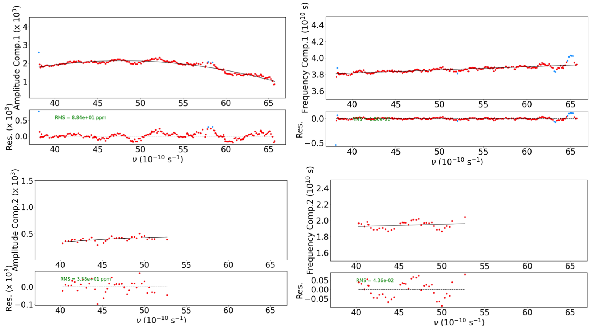

.. raw:: html

    

.. role:: orange

.. raw:: html

    

.. role:: green

.. raw:: html

    

.. role:: Magenta

Wiggle correction
=================

In this module two methods can be used to correct for the ESPRESSO "wiggles", using either an analytical model over the full visit (preferred), or a filter. The filter apporach is faster to implment, but introduces the risk where planetary and stellar features at medium resolution may be removed. The approach using a filter should be limited to observations where the wiggle patter is too complex to be captured with the analytical model. In this tutorial we first go thorugh the screening and filter methods, these are both relevant steps in order to perform before the final analytical correction.

Activate the module by setting :green:`gen_dic["corr_wig"]= True`. 

ESPRESSO wiggles screening
-------------------------------------

Go down to analysis and activate screening as shown below::

 gen_dic['wig_exp_init']={
     'mode':True,
     'plot_spec':True,
     'plot_hist':True,
     'y_range':None
     }

Initially, the noise levels in some parts of the spectrum will be much larger than the amplitude of the wiggles. Hence, use the screening to choose which ranges in :math:`\nu`, to include in the fit. In general, you will see large noise levels at the center of the spectrum :math:`(57-58)\nu` located at the edges of the blue and red detector. Furhter, you will see incerasing noise levels at the blue end of the spectrum, regions where the noise is much larger than the wiggle amplitude should be removed when fitting and characterising the wiggles. In :numref:`Fbal`, the wiggles are clearly visible, but the spectrum is dominated by noise at the blue end of the spectrum and at the center located at the edges of the blue and red detector. See the transmission spectrum for one exposure of TOI-421 b in :numref:`screening`.

.. figure:: wig_screening.png
  :width: 800
  :name: screening

  Transmission spectrum for TOI-421 b, displayed as the flux ratio as a funciton of frequeny. The wiggle pattern is clearly visible, but dominated by noise at the center and blue end of the spectrum. The spectrum is colour coded by spectral order.

From the transmission spectrum identify spectral ranges that are too noisy to be included in the fit::

 gen_dic['wig_range_fit'] = { 
            '20221117': [[20.,57.1],[57.8,67.3] ],   
            '20231106': [[20.,50.6],[51.1,54.2],[54.8,57.1],[57.8,67.3] ],         
        }

The final transmission spectrum with the excluded regions should show some clear periodic signals, as shown in :numref:`screening_final`.

.. figure:: screening.png
  :width: 800
  :name: screening_final

  Final transmission spectrum after removing the noisy regions. Bottom the periodogram computed for all exposures from the observation.

ESPRESSO wiggles filter
-------------------------------------

After removing the noisy ranges the wiggle pattern should be clearly visible from the screening, if that is not the case the wiggle correction will not be applied. When the spectral ranges to be included have been defined you can charecatrise the wiggles using the filter approach. Choose values for 'win' and 'deg', that are fine enough to capture the wiggle pattern without fitting spurious features in the data.::

 gen_dic['wig_exp_filt']={
         'mode':True,
         'win':0.3,
         'deg':4,
         'plot':True
         }

`Finish the Filter method later`

ESPRESSO wiggles Analytical model
-------------------------------------

From previous analyses we have determined that the wiggles are best described as the sum of multiple sinusoidal components, and can be expressed as

:math:`W(\nu, t) = 1 + \sum _k A_k(\nu, t) \sin(2\pi \int (F_k(\nu,t)d\nu ) - \Phi_k(t)).`

In this module, we follow a few iterative steps to find the best parameters to fit the wiggle pattern. The first two components to estimate are the frequencies and amplitudes, :math:`F_k(\nu)` and :math:`A_k(\nu)`, expressed as

:math:`A_k (\nu, t) = \sum_{i=0}^{d_{a,k}} a_{\text{chrom},k,i}(t)(\nu - \nu_{\text{ref}})^i`,

:math:`F_k (\nu, t) = \sum_{i=0}^{d_{f,k}} f_{\text{chrom},k,i}(t)(\nu - \nu_{\text{ref}})^i`.

In an earlier step, the screening, you should have identified spectral regions that can be used to constrain the wiggle pattern and to asses the strength of the two components. The second step is to sample the chromatic variations in a set of exposures. Here, we sample the frequency and amplitude of the wiggle components with :math:`\nu`. Choose a selection of exposures to sample under the field `Exposures to be characterized`, for TOI-421 we sample every fifth exposure:
::
 if gen_dic['star_name']=='TOI421a':
     gen_dic['wig_exp_in_fit'] =  {
        '20221117':np.arange(0,28,5),
        '20231106':np.arange(0,54,5)
        }

For the chromatic sampling we use a sliding window over each transmission spectrum to identify the strongest peak in each window at every window position and fit a sine function to the window spectrum using the frequency of the strongest peak. In narrow bands, the wiggles can be approximated with constant frequencies, and in this step we sample the frequencies :math:`F_k(\nu)`, and amplitude :math:`A_k(\nu)` for each window position. The windows must be large enough to sample several periods of the frequency, further successive window positions will overlap to sample enough measurments. In the case for TOI-421 b, we used the following settings for the chromatic sampling of the first component.
::
 gen_dic['wig_exp_samp']={
     'mode':True,
     'comp_ids':[1],#[1,2] for sampling second component
     'freq_guess':{
         1:{ 'c0':3.72, 'c1':0., 'c2':0.},
         2:{ 'c0':2.05, 'c1':0., 'c2':0.},
            },
     'nsamp':{1:8,2:8}, 
     'sampbands_shifts':{1:np.arange(16)*0.15,2:np.arange(16)*0.3},
     'direct_samp' : {2:0,3:0},
     'nit':40,
     'src_perio' : {
         1:{'mod':'slide','range':[0.5,0.5] ,'up_bd':False  },
         2:{'mod':'slide','range':[0.5,0.5] ,'up_bd':True  },
            }
     'fap_thresh':5,
     'fix_freq2expmod':[],
     'fix_freq2vismod':{},
     'plot':True
     }

.. Note::
 Description of parameters and variables:

    + :green:`comp_ids` which component to analyse, start with the first component (the high frequency component), when the first component is analysed add the second component to the list. Once the first component is processed the piecewise model built from the windows is used to temporarily correct the transmission spectrum, and the second component will be sampled and analysed. See :numref:`samp_1` and :numref:`samp_2`, for the example of TOI-421 b.
    + :green:`freq_guess` is the polynomial coefficient describing the model frequency for each component. The models control the definition of the sampling bands.
    + :green:`nsamp` number of cycles to sample for each compojent in a given band, this is based on the guess frequency.
    + :green:`nsampbands_shifts` set the shifts for the window between samples.
    + :green:`direct_samp` (check this one with vincent)
    + :green:`nit` number of iterations in each band
    + :green:`src_perio` frequency ranges within which periodograms are searched for each component (in :math:`1e-10 s^{-1}`). Use :green:`{'mod':None}` for default search range. To define the search range use :green:`{'mod':'slide', 'range':[y,z]}`. Use :green:`'up_bd':True` to use the the higher component as the upper bound of the search window.
    + :green:`fap_thresh` wiggle in a band is fitted if the FAP is below this threshold (in %).
    + :green:`fix_freq2expmod` [compi_id] fixes the frequency of 'comp_id' using the fit results from 'wig_exp_point_ana'.
    + :green:`fix_freq2vismod` fixes the frequency of 'comps' using the fit results from :green:`'wig_vis_fit'` at the given path for each visit, format is :green:`{comps:[x,y] , vis1:path1, vis2:path2 }`.
    + :green:`plot` plot the sampled transmission spectra and band sample analyses.

.. figure:: wiggle_sampling_1.png
  :width: 800
  :name: samp_1

  Sampling of the first component of TOI-421 b.

.. figure:: wiggle_sampling_2.png
  :width: 800
  :name: samp_2

  Sampling of the second component of TOI-421 b, here the piecewise model built from the sampling of the first component has been corrected for.

Next part is the chromatic analysis. Here we analyse the frequecy and amplitude of each sample from the previous step and model them as polynomials of :math:`\nu`. In most cases, the frequency and amplitude can be described as linear or quadratic funcitons of :math:`\nu`. This step allow us to detemine which degree and guess values a that are suitible for the chromatic coefficients :math:`a_{\text{chrom},k,i}(t)` and :math:`f_{\text{chrom},k,i}(t)` in each sampled exposure. In the case of TOI-421 b, we used the following determine the chromatic coefficients for the frequency and amplitude for the 2 components.
::
 gen_dic['wig_exp_nu_ana']={
     'mode':True,
     'comp_ids':[1,2],
     'thresh':3.,
     'plot':True
     }
 gen_dic['wig_deg_Freq'][1] = 1
 gen_dic['wig_deg_Freq'][2] = 0
 gen_dic['wig_deg_Amp'][1] = 2
 gen_dic['wig_deg_Amp'][2] = 2

Where 

